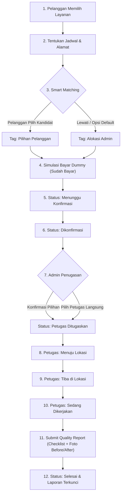

# CLAUDE.md — Onboarding & Operating Guide AI Coding Assistant (Resik.in)

> **Status:** Active Source of Truth Guidance for AI Coding Assistants  
> **Repository:** Resik.in — Prototipe Aplikasi Jasa Kebersihan On-Demand  
> **Target Pengguna AI:** Claude Code, Codex, Antigravity, Cursor, dan AI Agents lainnya.

---

## 1. Ringkasan Proyek & Tujuan Utama
**Resik.in** adalah aplikasi prototipe layanan kebersihan *on-demand* (berbasis web responsif) yang mendigitalisasi pemesanan jasa kebersihan tempat tinggal dan komersial. Sistem ini menggantikan pemesanan konvensional berbasis chat manual dengan alur terstruktur:
- **Katalog 4 Layanan Spesifik:** Pembersihan Rumah, Kos, Kantor, dan Pasca Renovasi.
- **Smart Petugas Matching:** Rekomendasi petugas berbasis aturan (*rule-based*) transparan.
- **Penugasan Hibrida (*Hybrid Assignment*):** Pilihan rekomendasi oleh pelanggan yang dikonfirmasi oleh Admin, dengan alur penugasan langsung (*fallback*) oleh Admin.
- **Pelacakan 7 Tahapan Status:** Memberikan transparansi progres pengerjaan lapangan secara bertahap kepada pelanggan.
- **Quality Report Digital:** Akuntabilitas hasil kerja berupa checklist area bersih dan komparasi foto *Before/After*.

---

## 2. Source of Truth & Integritas Requirement
- **Dokumen Acuan Tunggal:** `docs/PRD-Resik.in.md` adalah **Source of Truth (SOT)** mutlak untuk seluruh spesifikasi fungsional, batasan, alur bisnis, dan skema data.
- **Aturan Perubahan Requirement:** AI **DILARANG KERAS** menambah, mengubah, mengurangi, atau memodifikasi requirement secara diam-diam tanpa persetujuan eksplisit dari Tech Lead / User.
- **Prosedur Resolusi Konflik:** Jika ditemukan kontradiksi antara isi PRD, skema database (`database/schema.sql`), dan kode berjalan:
  1. **JANGAN MENEBAK** atau mengambil keputusan sepihak.
  2. **STOP** dan paparkan titik konflik secara objektif.
  3. Minta arahan dan keputusan dari Tech Lead sebelum melanjutkan implementasi.

---

## 3. Tech Stack & Arsitektur Sistem

| Komponen | Teknologi | Keterangan & Catatan Arsitektur |
| :--- | :--- | :--- |
| **Frontend** | HTML5, CSS3, Vanilla JavaScript | Tidak menggunakan framework (No React/Vue/Angular/Tailwind). Responsif untuk browser desktop dan *mobile*. |
| **Dashboard Build System** | Node.js Script (`scripts/build-dashboard.js`) | **PENTING:** Halaman pelanggan dirakit dari `public/dashboard.template.html` + komponen di `public/components/` dan modul JS di `public/js/modules/`. **Jangan mengedit langsung `public/dashboard.html` atau `public/js/dashboard.js`** karena akan tertimpa otomatis saat build/request dev. |
| **Admin & Cleaner UI** | `public/admin.html` & `public/cleaner.html` | Dasbor mandiri untuk operasional Admin (`public/js/admin.js`) dan Petugas Lapangan (`public/js/cleaner.js`). |
| **Backend API** | Node.js + Express.js | Arsitektur ES Module (`"type": "module"`). Router modular berada di direktori `routes/` (`services.js`, `cleaners.js`, `orders.js`). |
| **Database** | Supabase PostgreSQL | Penyimpanan relasional utama (Kawasan Singapore). Skema di `database/schema.sql`. Memiliki *fallback* in-memory store (`lib/supabase.js`) saat offline/demo. |
| **Autentikasi & Sesi** | Supabase Auth + JWT Session | Manajemen sesi aman multi-peran dengan validasi token/cookie yang kompatibel dengan arsitektur serverless. |
| **Penyimpanan Berkas** | Supabase Storage (`quality-reports`) | Bucket khusus untuk menyimpan berkas dokumentasi foto *Before* dan *After*. |
| **Hosting** | Vercel | Serverless deployment platform. |

---

## 4. Role Pengguna & Batasan Akses (RBAC)

Setiap endpoint dan antarmuka terikat pada hak akses spesifik:

| Role | Batas Akses & Hak Operasional | Larangan Keras |
| :--- | :--- | :--- |
| **`customer`**<br>(Pelanggan) | - Akses katalog 4 layanan.<br>- Mengisi jadwal, lokasi, detail properti, dan simulasi pembayaran dummy.<br>- Memilih rekomendasi petugas (*smart matching*) atau opsi serahkan ke admin.<br>- Memantau status stepper pesanan miliknya secara realtime.<br>- Melihat dokumen Quality Report pesanan miliknya.<br>- Mengirimkan rating dan ulasan pesanan selesai. | - Dilarang mengakses data pesanan milik pelanggan lain (wajib filter `customer_id` / `customer_email`).<br>- Dilarang mengakses dasbor admin atau cleaner.<br>- Dilarang memanipulasi status operasional petugas. |
| **`cleaner`**<br>(Petugas) | - Akses dasbor kerja petugas (`/cleaner.html`).<br>- Melihat daftar tugas kebersihan yang ditugaskan ke dirinya.<br>- Memperbarui status lapangan: `Menuju Lokasi`, `Tiba di Lokasi`, `Sedang Dikerjakan`.<br>- Mengisi formulir Quality Report (checklist area, foto Before/After terkompresi, catatan).<br>- Melihat profil dan riwayat pekerjaan sendiri. | - Dilarang mengakses atau memperbarui tugas milik petugas lain.<br>- Dilarang melakukan konfirmasi penugasan awal (wewenang Admin).<br>- Dilarang mengakses master data sistem. |
| **`admin`**<br>(Pengelola) | - Akses dasbor pengelola terpusat (`/admin.html`).<br>- Mengaktifkan/menonaktifkan katalog layanan.<br>- Mengelola data master petugas: tambah data baru, ubah status operasional (`Aktif`, `Sibuk`, `Cuti`, `Nonaktif`).<br>- Konfirmasi penugasan hibrida (menyetujui pilihan customer atau alokasi langsung).<br>- Membatalkan pesanan disertai pencatatan alasan.<br>- Melihat catatan audit (`status_logs`) dan ekspor data ke CSV. | - Dilarang menghapus riwayat audit status.<br>- Dilarang mengabaikan validasi jadwal ganda petugas saat alokasi. |

---

## 5. Fitur Inti & Alur Bisnis Utama

- **FR-01 Katalog Layanan:** Menampilkan 4 jenis layanan: Pembersihan Rumah, Kos, Kantor, dan Pasca Renovasi beserta estimasi durasi dan tarif dasar.
- **FR-02 Penjadwalan Terstruktur:** Pemilihan tanggal fleksibel ($\ge \text{H+0}$) dan slot jam kedatangan standar (misal: 08.00, 10.00, 13.00, 15.00 WIB).
- **FR-03 Pemesanan & Pembayaran Dummy:** Formulir alamat lengkap, patokan, luas area, dan catatan. Transaksi disimulasikan: `Belum Bayar` $\rightarrow$ Pelanggan klik "Bayar Sekarang (Simulasi)" $\rightarrow$ `Sudah Bayar` $\rightarrow$ Order tersimpan dengan status awal `Menunggu Konfirmasi`.
- **FR-04 Manajemen Data Master Petugas:** Admin mengelola nama, nomor WhatsApp, spesialisasi keahlian, pengalaman tahun, dan status operasional.
- **FR-05 Penugasan Petugas Hibrida (*Hybrid Assignment*):**
  - **Jalur Rekomendasi (Pilihan Pelanggan):** Pelanggan memilih salah satu kandidat matching $\rightarrow$ Pesanan masuk admin bertanda "Pilihan Pelanggan: [Nama]" $\rightarrow$ Admin menekan tombol "Konfirmasi Penugasan" $\rightarrow$ Status: `Petugas Ditugaskan`.
  - **Jalur Fallback (Penugasan Langsung):** Pelanggan melewati opsi / pilih default "Pilihkan Otomatis oleh Admin" $\rightarrow$ Admin memilih petugas berstatus `Aktif` dari dropdown $\rightarrow$ Admin klik "Tugaskan Langsung" $\rightarrow$ Status: `Petugas Ditugaskan`.
- **FR-06 Pelacakan 7 Tahap Status:** Pembaruan status transparan dengan indikator stepper visual.
- **FR-07 Manajemen Pengguna & Riwayat:** Autentikasi multi-role dan isolasi riwayat order per user.
- **FR-08 Smart Petugas Matching:** Mesin rekomendasi rule-based di langkah pemesanan.
- **FR-09 Quality Report Digital:** Formulir penyelesaian kerja berbasis bukti foto dan checklist.
- **FR-10 Cleaning Plan (Fase 3 / Should Have):** Penjadwalan berulang berkala (mingguan/dua mingguan).



---

## 6. Urutan 7 Status Pekerjaan (*Strict Sequential Lifecycle*)

Siklus status pekerjaan wajib mengikuti urutan baku 7 tahap berikut secara sekuensial:

$$\text{Menunggu Konfirmasi} \longrightarrow \text{Dikonfirmasi} \longrightarrow \text{Petugas Ditugaskan} \longrightarrow \text{Menuju Lokasi} \longrightarrow \text{Tiba di Lokasi} \longrightarrow \text{Sedang Dikerjakan} \longrightarrow \text{Selesai}$$

1. **`Menunggu Konfirmasi`**: Pesanan berhasil dibuat oleh pelanggan setelah simulasi pembayaran sukses.
2. **`Dikonfirmasi`**: Admin meninjau dan menyetujui pesanan untuk diproses alokasi petugas.
3. **`Petugas Ditugaskan`**: Petugas resmi ditetapkan (baik melalui konfirmasi pilihan pelanggan atau penugasan langsung admin). Tugas muncul di dasbor petugas.
4. **`Menuju Lokasi`**: Petugas menekan tombol berangkat menuju alamat pelanggan.
5. **`Tiba di Lokasi`**: Petugas menekan tombol konfirmasi telah sampai di lokasi pengerjaan.
6. **`Sedang Dikerjakan`**: Petugas menekan tombol mulai bekerja; formulir Quality Report mulai terbuka di sisi petugas.
7. **`Selesai`**: Petugas berhasil mengirimkan Quality Report lengkap (checklist + foto Before/After); pesanan terkunci permanen (*read-only*).

> **Catatan Pembatalan:** Status `Dibatalkan` hanya dapat dipicu melalui aksi pembatalan khusus (misal oleh Admin) dan wajib mencatat alasan pembatalan ke dalam tabel `status_logs`.

---

## 7. Aturan Smart Petugas Matching (*Rule-Based*)

Modul rekomendasi petugas bersifat **murni berbasis aturan (*rule-based*)**, tidak menggunakan model machine learning atau AI prediksi.

### Aturan Filter & Pembobotan:
1. **Pemeriksaan Ketersediaan & Status:**
   - Status operasional petugas wajib bernilai `Aktif`. Petugas `Sibuk`, `Cuti`, atau `Nonaktif` langsung dieliminasi.
   - **Bebas Jadwal Bentrok (*Anti-Double Booking*):** Petugas tidak boleh memiliki penugasan lain yang bertabrakan pada tanggal (`tanggal_layanan`) dan slot jam (`jam_mulai`) yang sama.
2. **Kesesuaian Keahlian (*Skill Matching*):**
   - Petugas yang memiliki keahlian/spesialisasi sesuai kategori layanan yang dipesan (contoh: keahlian *Pasca Renovasi* untuk pesanan kategori *Pasca Renovasi*) diprioritaskan di posisi atas dengan badge **"Sangat Sesuai"**.
3. **Perankingan Reputasi:**
   - Kandidat diurutkan berdasarkan kombinasi nilai rating tertinggi ($\ge 4.5$) dan jumlah total pekerjaan sukses terbanyak.
4. **Penyajian di Antarmuka:**
   - Sistem menampilkan kartu rekomendasi berisi: foto, nama lengkap, badge keahlian, rating bintang, dan tahun pengalaman.
   - Pelanggan diberikan kebebasan: memilih salah satu petugas rekomendasi, atau memilih opsi default *"Pilihkan Otomatis oleh Admin"*.

---

## 8. Aturan Quality Report Digital & Unggah Foto Before/After

Modul Quality Report merupakan instrumen akuntabilitas utama hasil kerja di lapangan:
- **Aktor Pengisi:** Hanya dapat diisi dan dikirim oleh **Petugas Kebersihan (*Cleaner*)** yang ditugaskan.
- **Kondisi Akses:** Formulir laporan hanya aktif ketika status pesanan adalah `Sedang Dikerjakan`.
- **Komponen Wajib Laporan:**
  1. **Checklist Area:** Mencentang area-area yang tuntas dibersihkan (Ruang Tamu, Kamar Mandi, Dapur, Jendela/Balkon, dll.).
  2. **Foto Before:** Minimal 1 foto kondisi awal ruangan sebelum dibersihkan.
  3. **Foto After:** Minimal 1 foto kondisi ruangan setelah tuntas dibersihkan.
  4. **Catatan Petugas:** Ringkasan kondisi atau catatan khusus pengerjaan.
- **Optimasi Gambar di Sisi Klien (*Mandatory Client-Side Compression*):**
  - Foto dari kamera ponsel beresolusi tinggi **wajib dikompresi di browser menggunakan Canvas API** (`compressImage`) sebelum diunggah ke backend/storage.
  - Ukuran target kompresi berkisar antara 1–2 MB per foto untuk menghemat kuota Supabase Storage dan mempercepat proses kirim pada koneksi seluler.
- **Penyimpanan:** Berkas disimpan pada bucket Supabase Storage `quality-reports`.
- **Dampak Finalisasi:**
  - Menekan tombol "Kirim Laporan & Selesaikan" akan menyimpan data ke tabel `quality_reports`, mengubah status pesanan menjadi `Selesai`, mengunci laporan menjadi *read-only*, menambahkan akumulasi `total_pekerjaan` petugas, dan mengembalikan status petugas ke `Aktif`.
  - Pelanggan dan Admin dapat membuka dokumen Quality Report secara transparan melalui modal rincian pesanan.

---

## 9. Entitas & Skema Basis Data Utama

Berikut adalah entitas utama yang wajib dijaga konsistensi relasi dan integritas kolomnya (sesuai `database/schema.sql`):

- **`users`**: Akun pengguna sistem.
  - Kolom: `id`, `nama`, `email`, `nomor_wa`, `password_hash`, `role` (`customer` | `cleaner` | `admin`), `created_at`.
- **`services`**: Master katalog layanan.
  - Kolom: `id`, `nama_layanan`, `kategori` (`rumah` | `kos` | `kantor` | `pasca_renovasi`), `deskripsi`, `durasi_estimasi`, `tarif_dasar`, `icon_name`, `is_active`.
- **`cleaners`**: Profil profesional petugas kebersihan.
  - Kolom: `id`, `user_id`, `nama`, `nomor_kontak`, `keahlian` (array/text), `pengalaman_tahun`, `rating_rata_rata`, `total_pekerjaan`, `status_operasional` (`Aktif` | `Sibuk` | `Cuti` | `Nonaktif`).
- **`orders`**: Transaksi pemesanan layanan.
  - Kolom: `id`, `customer_id`, `cleaner_id`, `service_id`, `alamat_lengkap`, `patokan_lokasi`, `luas_area`, `catatan_khusus`, `tanggal_layanan`, `jam_mulai`, `status_pembayaran` (`Belum Bayar` | `Sudah Bayar`), `status_pekerjaan` (7 status), `preferensi_petugas_id`, `created_at`.
- **`quality_reports`**: Laporan verifikasi hasil kerja.
  - Kolom: `id`, `order_id`, `cleaner_id`, `checklist_area` (JSON), `foto_before_url`, `foto_after_url`, `catatan_petugas`, `waktu_submit`.
- **`status_logs`**: Log audit perubahan tahapan pesanan.
  - Kolom: `id`, `order_id`, `status_sebelumnya`, `status_baru`, `diubah_oleh`, `waktu_perubahan`.
- **`cleaning_plans`**: Langganan jadwal berkala (Fase 3).
  - Kolom: `id`, `customer_id`, `service_id`, `cleaner_id`, `frekuensi`, `hari_tetap`, `jam_mulai`, `status_plan`.

---

## 10. Konvensi Coding & Prinsip Perubahan Kode

- **Prinsip Perubahan Minimal (*Minimal Diff Principle*):**
  - Lakukan perubahan dengan bedah kode presisi pada baris/fungsi yang relevan.
  - **DILARANG** melakukan refactoring massal, restrukturisasi file yang tidak diminta, atau menghapus komentar yang ada tanpa instruksi eksplisit.
- **Arsitektur Dashboard Assembly:**
  - Kode sumber frontend dashboard pelanggan berada di `public/components/` (HTML) dan `public/js/modules/` (JS).
  - Jika mengubah tampilan atau logika dashboard pelanggan, lakukan pada direktori komponen/modul tersebut, kemudian jalankan `npm run build` (atau biarkan auto-assemble berjalan saat server dev aktif).
- **Backend Style & Format Respons:**
  - Gunakan syntax ES Module modern (`import` / `export`).
  - Respons API wajib konsisten menggunakan amplop JSON:
    - Sukses: `{ "success": true, "message": "...", "data": { ... } }`
    - Gagal: `{ "success": false, "message": "...", "error": "..." }`
- **Error Handling Komprehensif:**
  - Setiap endpoint Express wajib membungkus logika asinkron dalam `try / catch` dan meneruskan error ke central JSON error handler.
  - Jangan pernah membiarkan error Express membocorkan HTML trace stack ke klien.
- **Immutability Data:**
  - Buat objek/array baru saat transformasi data; jangan memutasi variabel state global secara serampangan.

---

## 11. Keamanan, Otorisasi, Upload Berkas, & Anti-Double Booking

1. **Otorisasi Server-Side:**
   - **JANGAN PERNAH** hanya mengandalkan pengecekan UI/JavaScript browser untuk membatasi akses role. Seluruh endpoint mutasi dan query sensitif wajib divalidasi di backend (Express middleware / RLS Supabase).
   - Pastikan endpoint `GET /api/orders` menerapkan filter berbasis `customer_id` atau `customer_email` agar data pesanan antarpengguna tidak bocor.
2. **Pengelolaan Secrets & API Keys:**
   - Kunci sensitif `SUPABASE_SERVICE_ROLE_KEY` **HANYA BOLEH DIGUNAKAN DI SISI BACKEND** (`.env`).
   - **DILARANG KERAS** membocorkan service-role key ke frontend, file statis di `public/`, atau response JSON `/api/config`.
   - Frontend hanya boleh menerima `SUPABASE_URL` dan `SUPABASE_ANON_KEY`.
3. **Pencegahan Double Booking (Bentrok Jadwal):**
   - Backend wajib memvalidasi jadwal sebelum menyimpan penugasan (`cleaner_id`).
   - Validasi: Tidak boleh ada pesanan aktif lain milik petugas bersangkutan pada kombinasi `tanggal_layanan` dan `jam_mulai` yang sama.
4. **Validasi & Penanganan Upload File:**
   - Periksa tipe MIME file gambar (`image/jpeg`, `image/png`, `image/webp`).
   - Batasi ukuran body JSON/payload di Express (limit aman 25MB untuk base64 payload jika upload langsung, dengan kompresi client-side 1–2 MB).

---

## 12. Cara Menjalankan Test & Build (Aturan Tanpa Mengarang Perintah)

**ATURAN UTAMA:** Selalu periksa `package.json` terlebih dahulu. **JANGAN PERNAH MENGARANG COMMAND** (misal: jangan gunakan `jest`, `vite`, `mocha`, `npm run lint` jika tidak ada di script repository).

Script resmi yang terdaftar di repository:
- **Menjalankan Test Suite:**
  ```bash
  npm test
  ```
  *(Mengeksekusi native Node.js test runner: `node --test test/*.test.js`). Pastikan seluruh test (100+ assertions) berstatus lulus (green) sebelum dan sesudah perubahan.*
- **Merakit (*Build*) Dashboard:**
  ```bash
  npm run build
  ```
  *(Mengeksekusi `node scripts/build-dashboard.js` untuk meng-assemble HTML dan JS modular dashboard).*
- **Menjalankan Server Mode Dev:**
  ```bash
  npm run dev
  ```
  *(Mengeksekusi `node --watch server.js` dengan hot-reload dan auto-build dashboard).*
- **Menjalankan Server Mode Produksi:**
  ```bash
  npm start
  ```
  *(Mengeksekusi `node server.js`).*

---

## 13. JANGAN DILAKUKAN (*Out-of-Scope PRD & Anti-Patterns*)

Untuk menjaga fokus skripsi dan stabilitas sistem, AI dilarang keras melakukan hal-hal berikut:

- ❌ **JANGAN mengintegrasikan Payment Gateway live** (seperti Midtrans, Xendit, Stripe, atau bank API riil). Sistem prototipe ini hanya menggunakan simulasi checkout dummy (`Belum Bayar` $\rightarrow$ `Sudah Bayar`).
- ❌ **JANGAN membuat chatbot AI interaktif** untuk konsultasi kebutuhan (fitur ini resmi ditunda dari scope prototipe).
- ❌ **JANGAN membuat pelacakan koordinat GPS live** di peta digital. Cukup gunakan representasi stepper progres 7 tahapan status.
- ❌ **JANGAN membuat modul payroll**, bagi hasil, atau transfer gaji petugas kebersihan.
- ❌ **JANGAN membuat formulir registrasi mandiri untuk petugas kebersihan** (akun petugas didaftarkan secara internal oleh Admin).
- ❌ **JANGAN membuat sistem manajemen inventaris stok bahan pembersih** atau pembukuan akuntansi laba-rugi perusahaan.
- ❌ **JANGAN menerapkan algoritma Machine Learning yang rumit** yang memerlukan pelatihan dataset besar. Rekomendasi wajib murni rule-based.
- ❌ **JANGAN mengganti tech stack utama** (Node.js/Express, Supabase, Vanilla HTML/CSS/JS) dengan React, Next.js, Vue, Tailwind, atau ORM berat tanpa instruksi eksplisit tertulis dari Tech Lead.
- ❌ **JANGAN mengekspos credential rahasia** (`SUPABASE_SERVICE_ROLE_KEY`) ke frontend atau commit file rahasia ke repository.
- ❌ **JANGAN melakukan refactor besar-besaran** jika tiket tugas hanya meminta perbaikan atau penyesuaian minor.

---

## 14. Workflow AI Coding Assistant

Setiap kali AI menerima instruksi atau tugas baru pada proyek Resik.in, jalankan siklus 5 tahap berikut:

```
[ 1. INSPECT ] ──> [ 2. PLAN ] ──> [ 3. IMPLEMENT ] ──> [ 4. VERIFY ] ──> [ 5. REPORT ]
```

1. **INSPECT (Pemeriksaan Awal):**
   - Pahami kebutuhan tugas dan rujuk ke dokumen `docs/PRD-Resik.in.md`.
   - Telusuri file dan komponen yang terlibat. Cek apakah ada script build terkait.
   - Periksa `package.json` untuk mengetahui perintah yang valid.
2. **PLAN (Perencanaan Terukur):**
   - Rancang langkah perubahan dengan cakupan diff terkecil (*minimal diff*).
   - Pastikan rencana menghormati isolasi hak akses (RBAC), siklus 7 status, dan aturan anti-double booking.
   - Jika terdapat pertentangan spesifikasi atau dependensi ambigu: **STOP dan tanyakan kepada pengguna**.
3. **IMPLEMENT (Eksekusi Kode):**
   - Tulis kode yang bersih, modular, dan mengikuti konvensi proyek (ES Module, Vanilla JS).
   - Terapkan validasi server-side dan error handling di backend.
   - Jika menyentuh dashboard pelanggan, lakukan perubahan di `public/components/` atau `public/js/modules/`, lalu jalankan `npm run build`.
4. **VERIFY (Verifikasi & Pengujian Mandiri):**
   - Jalankan `npm test` untuk membuktikan tidak ada regresi pada seluruh test suite.
   - Pastikan perubahan lulus uji fungsional dan tidak memicu warning atau error di console/server.
5. **REPORT (Pelaporan Ringkas & Terbukti):**
   - Sajikan laporan perubahan yang ringkas, transparan, dan langsung pada pokok masalah.
   - Sertakan bukti hasil verifikasi (status kelulusan test) tanpa narasi bertele-tele.
