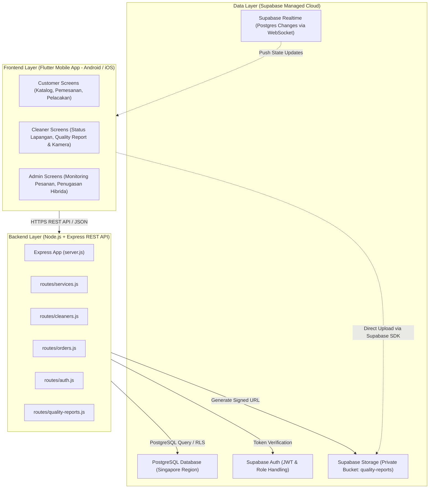
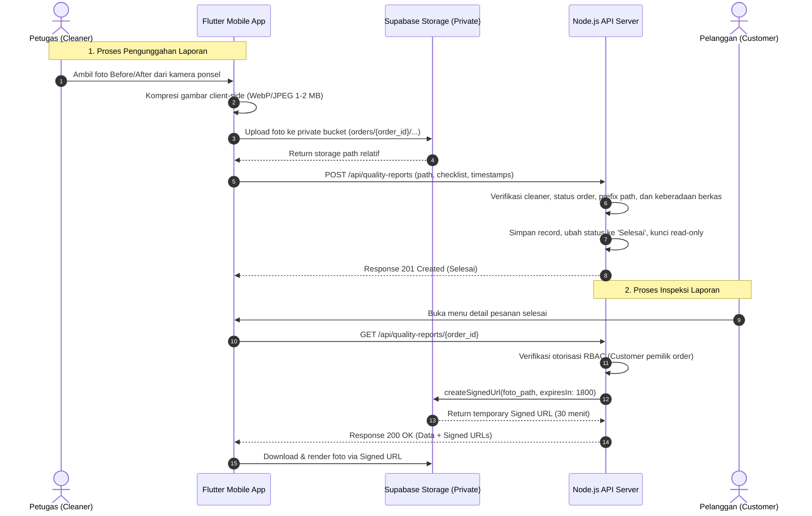

# ARSITEKTUR SISTEM & PANDUAN TEKNOLOGI
## Resik.in — Aplikasi Jasa Kebersihan On-Demand

> **Status Dokumen:** Active Technical Architecture Specification  
> **Versi Dokumen:** 1.2 (Hardened)  
> **Tanggal Pembaruan:** 26 September 2026  
> **Dokumen Induk:** `docs/PRD-Resik.in.md`, `docs/BUSINESS-RULES.md`, `docs/SECURITY.md`  

---

## 1. Ikhtisar Arsitektur Sistem

Resik.in dibangun menggunakan arsitektur *Mobile Client-Server* modern. Antarmuka pengguna dikembangkan sebagai **Aplikasi Mobile Lintas Platform (Flutter / Dart)** untuk Android & iOS, didukung oleh **REST API Server (Node.js + Express)** serta **Managed Cloud Database & Storage (Supabase)**.

---

## 2. Tech Stack & Komponen Arsitektur

| Lapisan | Pilihan Teknologi | Keterangan & Catatan Desain |
| :--- | :--- | :--- |
| **Frontend UI (Mobile)** | Flutter (Dart) | Aplikasi mobile lintas platform (Android & iOS). Menyediakan performa native tinggi, antarmuka responsif, dan akses hardware kamera ponsel untuk dokumentasi Quality Report. |
| **Backend API** | Node.js + Express.js | Arsitektur modern ES Module (`"type": "module"`). Menyediakan REST API modular di direktori `routes/` dengan standard JSON response envelope. |
| **Database Relasional** | Supabase PostgreSQL | Penyimpanan relasional utama (Kawasan Singapore). Skema terstruktur dengan relasi referensial dan RLS (*Row Level Security*). Fallback in-memory store disediakan untuk demonstrasi lokal/offline. |
| **Autentikasi Pengguna** | Supabase Auth + Session JWT | Manajemen identitas tunggal. Akun tersimpan di `auth.users`, aplikasi menggunakan token JWT untuk verifikasi peran (*role guard*). Tidak ada penyimpanan password lokal. |
| **Penyimpanan Berkas** | Supabase Storage (Private Bucket: `quality-reports`) | Bucket privat berotoritas terbatas untuk mengarsipkan foto bukti fisik *Before* dan *After*. Akses baca wajib melalui temporary Signed URL. |
| **Sinkronisasi Status** | Supabase Realtime + Short Polling Fallback | Sinkronisasi status instan tanpa refresh manual via stream WebSocket / fallback interval 15 detik. |
| **Struktur Repositori** | Monorepo Modular | `backend/` untuk REST API Server, `mobile/` untuk Flutter Mobile App, `database/` untuk SQL schema, dan `docs/` untuk dokumentasi resmi. |

---

## 3. Strategi Real-Time (Primary & Fallback)

Untuk mewujudkan kebutuhan PRD di mana perubahan status terlihat langsung tanpa penyegaran (*refresh*) manual:

### 3.1 Kanal Utama (*Primary Strategy*): Supabase Realtime
- Antarmuka frontend (halaman detail pesanan pelanggan dan dasbor pemantauan admin) membuka koneksi WebSocket menggunakan klien Supabase (`supabase.channel('order-status-' + orderId)`).
- Mendengarkan event `UPDATE` pada tabel `orders` yang difilter khusus untuk ID pesanan aktif.
- Begitu baris pesanan dimutasi oleh backend (misal status berubah ke `Menuju Lokasi` atau `Sedang Dikerjakan`), perubahan status dikirimkan secara instan (*push notification*) dan stepper visual ter-update secara langsung.

### 3.2 Kanal Cadangan (*Fallback Strategy*): Short Polling
- Jika koneksi WebSocket gagal terbentuk, diblokir oleh firewall jaringan seluler, atau terputus:
  - Antarmuka secara mulus (*graceful degradation*) mengaktifkan mekanisme **Short Polling** dengan interval **15 detik**.
  - Polling hanya aktif selama pesanan berada dalam tahapan pengerjaan berjalan (`Petugas Ditugaskan` s.d. `Sedang Dikerjakan`) dan otomatis berhenti setelah pesanan mencapai terminal state (`Selesai` atau `Dibatalkan`).
  - Request polling hanya meminta payload minimal (`status_pekerjaan`) guna menghemat bandwidth.

---

## 4. Arsitektur Private Storage & Signed URL Quality Report

Untuk menjamin kerahasiaan foto area privat tempat tinggal pelanggan:

1. **Private Bucket Enforcement:** Bucket `quality-reports` dikonfigurasi dengan `public = false`. Tidak ada berkas yang dapat diakses melalui URL statis publik.
2. **Path Sanitization:** Backend menolak penyimpanan berkas jika `foto_before_path` dan `foto_after_path` tidak diawali dengan prefix `orders/{order_id}/`.
3. **Masa Berlaku Signed URL:** Signed URL yang diterbitkan server dibatasi kedaluwarsa dalam **30 menit (1800 detik)**. Setelah waktu tersebut, token habis dan tautan tidak dapat digunakan kembali.

---

## 5. Arsitektur Snapshot Transaksi & Pembayaran Server-Authoritative

1. **Pembuatan Booking:**
   - Klien mengirimkan formulir booking tanpa data status bayar.
   - Backend membaca `services.tarif_dasar` dari database, menetapkan $\text{harga\_saat\_booking} = \text{tarif\_dasar}$, dan $\text{total\_biaya} = \text{harga\_saat\_booking}$.
   - Backend mengeset status bayar awal: `Belum Bayar`.
2. **Eksekusi Simulasi Pembayaran:**
   - Klien memanggil endpoint mutasi `POST /api/orders/:id/pay`.
   - Backend memverifikasi token dan hak akses, memvalidasi order saat ini bernilai `Belum Bayar`.
   - Backend memutasi database menjadi `status_pembayaran = 'Sudah Bayar'` dan `payment_timestamp = NOW()`.
   - Klien tidak pernah diizinkan mengubah status pembayaran secara sepihak.
