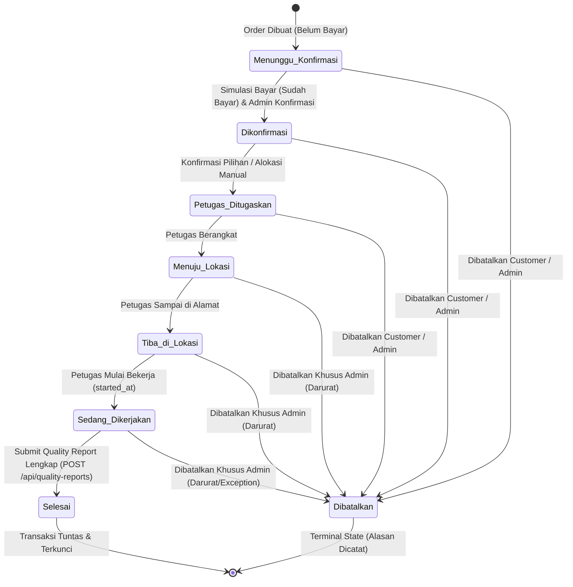
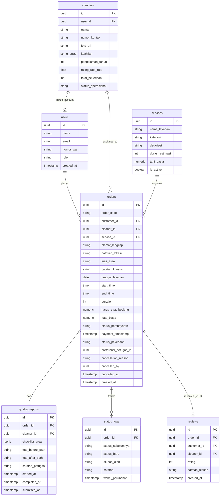

# PRODUCT REQUIREMENTS DOCUMENT (PRD)
## Aplikasi Jasa Kebersihan On-Demand (Resik.in)
### Untuk Pemesanan Layanan, Penjadwalan Petugas, dan Status Pekerjaan

**UNIVERSITAS ISLAM INDONESIA**  
**FAKULTAS TEKNOLOGI INDUSTRI**  

- **Nama Mahasiswa:** Agil Seno Adjie
- **Versi Dokumen:** 1.2 (Hardened & Specification-Complete)
- **Tanggal Pembaruan:** 26 September 2026
- **Status Dokumen:** **Source of Truth (SOT) Utama Fungsional & Spesifikasi Produk**

---

### Metadata Dokumen

| Metadata | Keterangan |
| :--- | :--- |
| **Kode Dokumen** | PRD-RESIKIN-2026-V1.2 |
| **Versi Dokumen** | 1.2 — Final Requirement Hardening: Formula Harga Flat Deterministik, Alur Pembayaran Server-Authoritative, Private Storage & Signed URL Quality Report, Rating Provisional Smart Matching, dan Spesifikasi Audit Reassignment |
| **Status Proyek** | Prototipe Fungsional — Acuan Mutlak Arsitektur, Backend, dan Frontend |
| **Bidang Fokus** | Digitalisasi Manajemen Operasional Layanan Jasa Kebersihan *On-Demand* |
| **Target Pembaca** | Dosen Pembimbing, Dosen Penguji Skripsi, Tech Lead, AI Coding Agents |
| **Arsitektur Sistem**| Frontend Mobile App (Flutter / Dart untuk Android & iOS) — Backend REST API Node.js (Express ES Module) — Data Layer Supabase (PostgreSQL + Auth + Storage Private) |
| **Dokumen Terkait** | `docs/BUSINESS-RULES.md`, `docs/API.md`, `docs/DATA-DICTIONARY.md`, `docs/ARCHITECTURE.md`, `docs/SECURITY.md`, `docs/TESTING.md`, `docs/ROADMAP.md` |

---

## 1. Ringkasan Produk (*Executive Summary*)

**Resik.in** adalah prototipe aplikasi *mobile* layanan kebersihan *on-demand* (berbasis Flutter) yang mendigitalisasi proses pemesanan jasa kebersihan tempat tinggal dan komersial (Pembersihan Rumah, Kos, Kantor, dan Pasca Renovasi). Menggantikan alur pemesanan konvensional berbasis chat manual yang rawan miskomunikasi, tanpa kepastian alokasi petugas, dan minim pengawasan hasil kerja, Resik.in menyediakan sistem terintegrasi yang menghadirkan efisiensi dan transparansi menyeluruh.

Sistem Resik.in dibangun atas **tiga pilar operasional**:
1. **Transparansi Penugasan (*Smart Petugas Matching & Hybrid Assignment*):** Rekomendasi petugas berbasis aturan (*rule-based*) transparan dan berbobot pasti, dipadukan dengan keleluasaan pelanggan untuk memilih atau menyerahkan alokasi kepada Admin.
2. **Visibilitas Progres (*Sequential Status Tracking*):** Pelacakan progres pekerjaan 7 tahapan sekuensial yang terpantau langsung (*real-time* dari sisi pengalaman pengguna) tanpa perlu memuat ulang antarmuka secara manual (*real-time reactive UI*).
3. **Akuntabilitas Mutu Digital (*Quality Report Gate*):** Standar penyelesaian pekerjaan berbasis bukti nyata berupa checklist area kerja terverifikasi, komparasi foto *Before/After* yang tersimpan aman pada private storage, catatan petugas, serta pencatatan tiga waktu pengerjaan presisi (`started_at`, `completed_at`, `submitted_at`), yang menjadi prasyarat mutlak sebelum pesanan dapat dinyatakan berstatus `Selesai`.

### Pembagian Tahapan Produk (*Product Scope Phases*)
- **V1 (Prototipe Utama):** Fokus pada validasi alur transaksi end-to-end, pencatatan jadwal berbasis interval waktu dan buffer 30 menit, formula harga flat deterministik, alur pembayaran server-authoritative, Smart Matching deterministik (dengan rating provisional untuk petugas baru), konfirmasi penugasan admin, dasbor operasional admin mandiri, pelacakan 7 status, pembatalan terstruktur, serta Quality Report berbasis private storage sebagai gerbang status Selesai.
- **V1.1 (Fase 2 / Penyempurnaan Pasca-Evaluasi):** Modul Rating & Review dari pelanggan untuk petugas atas pesanan yang telah tuntas, serta penyempurnaan antarmuka dari hasil uji pengguna.
- **V2 (Fase 3 / Rencana Lanjutan):** Modul Cleaning Plan untuk pemesanan rutin berulang (mingguan / dua mingguan).

---

## 2. Latar Belakang dan Rumusan Masalah

Berdasarkan analisis operasional lapangan dan eksplorasi produk, pemesanan jasa kebersihan konvensional menghadapi lima kendala mendasar:

1. **Pemesanan Tidak Terstruktur:** Ketiadaan formulir baku menyebabkan parameter penting seperti jenis properti, perkiraan luas area, patokan lokasi spesifik, dan instruksi khusus sering terabaikan dalam percakapan chat manual, memicu sengketa tarif atau salah peralatan saat petugas tiba.
2. **Kerumitan Alokasi & Risiko Jadwal Tumpang Tindih (*Double Booking*):** Pengelola mengalokasikan petugas secara manual berdasarkan ingatan atau catatan kertas, sehingga kerap terjadi jadwal bentrok antarpesanan pada jam sibuk serta ketidaksesuaian keahlian petugas terhadap tingkat kotoran (misalnya debu semen pasca renovasi).
3. **Ketidakpastian Progres Pengerjaan bagi Pelanggan:** Setelah mentransfer uang, pelanggan berada dalam kondisi pasif tanpa mengetahui apakah pesanan sudah diproses, petugas sedang di jalan, sudah sampai, atau sedang bekerja.
4. **Kekhawatiran Keamanan & Kredibilitas Petugas:** Pelanggan enggan mengizinkan tenaga kerja asing masuk ke area tempat tinggal privat tanpa adanya transparansi rekam jejak, foto profil, rating kepuasan, dan spesialisasi keahlian petugas.
5. **Ketiadaan Bukti Hasil Pengerjaan yang Akuntabel:** Pelanggan yang sedang bekerja di luar rumah tidak memiliki sarana pembuktian objektif mengenai kualitas kebersihan ruangan, sehingga timbul keraguan apakah seluruh area yang dipesan benar-benar telah dikerjakan secara tuntas.

---

## 3. Tujuan Produk

- Menyediakan antarmuka pemesanan mandiri dengan katalog terstruktur untuk 4 jenis properti (Rumah, Kos, Kantor, Pasca Renovasi) dengan estimasi durasi dan snapshot tarif tetap.
- Mengotomatiskan validasi ketersediaan petugas berbasis interval waktu (`start_time`, `end_time = start_time + duration`) dan buffer operasional 30 menit guna mencegah *double booking*.
- Menerapkan mesin rekomendasi *Smart Petugas Matching* berbasis aturan matematis transparan (bobot 40% keahlian, 30% ketersediaan, 20% rating, 10% pengalaman) dan alur penugasan hibrida yang menyeimbangkan preferensi pelanggan dengan verifikasi Admin.
- Memberikan visibilitas progres pekerjaan 7 status sekuensial kepada pelanggan secara instan tanpa perlu memuat ulang peramban.
- Menjamin mutu hasil kerja melalui modul *Quality Report* digital berstatus *read-only* dengan penyimpanan private storage dan akses aman berbasis temporary signed URL yang menjadi gerbang penentu status `Selesai`.
- Menyediakan Dasbor Operasional Admin untuk manajemen pesanan, filter status, penugasan langsung, pembatalan berdasar alasan, dan audit log lengkap.

---

## 4. Target Pengguna dan Hak Akses (RBAC)

Sistem membedakan tiga peran pengguna dengan isolasi data yang ketat:

| Peran | Deskripsi | Hak Akses & Operasional | Batasan & Larangan Keras |
| :--- | :--- | :--- | :--- |
| **`customer`** (Pelanggan) | Pengguna yang memesan jasa kebersihan untuk area tempat tinggal atau komersial. | - Mengakses katalog 4 layanan. - Memilih jadwal valid dan mengisi formulir detail pesanan. - Mendapatkan rekomendasi petugas deterministik atau memilih alokasi admin. - Memulai pesanan (status bayar awal: `Belum Bayar`) dan mengeksekusi simulasi pembayaran. - Memantau progres 7 status pesanan miliknya. - Membatalkan pesanan mandiri sebelum status `Sedang Dikerjakan`. - Mengakses Quality Report miliknya via temporary Signed URL. - Memberikan Rating & Review pada pesanan berstatus `Selesai` (V1.1). | - Dilarang mengakses data pesanan milik pelanggan lain. - Dilarang membatalkan pesanan jika sudah masuk tahap `Sedang Dikerjakan` atau `Selesai`. - Dilarang memanipulasi status pembayaran secara mandiri (wajib lewat endpoint validasi simulasi). - Dilarang mengakses berkas storage milik pesanan lain. |
| **`cleaner`** (Petugas) | Tenaga lapangan pelaksana pembersihan yang ditugaskan. | - Mengakses dasbor kerja petugas (`/cleaner.html`). - Melihat daftar tugas yang dialokasikan khusus kepada dirinya. - Memperbarui status lapangan: `Menuju Lokasi`, `Tiba di Lokasi`, `Sedang Dikerjakan`. - Mengunggah foto Before/After terkompresi ke private storage dan mengirimkan formulir Quality Report lengkap. - Melihat riwayat tugas dan profil pribadi. | - Dilarang mengakses dan memperbarui pesanan milik petugas lain. - Dilarang mengonfirmasi penugasan awal (wewenang Admin). - Dilarang mengubah status menjadi `Selesai` tanpa mengirimkan Quality Report yang valid. - Dilarang mengubah data laporan setelah status menjadi `Selesai`. |
| **`admin`** (Pengelola) | Penanggung jawab operasional bisnis Resik.in. | - Mengakses dasbor manajemen terpusat (`/admin.html`). - Mengelola katalog layanan (aktif/nonaktif). - Mengelola master data petugas dan status operasionalnya. - Memantau seluruh pesanan, pencarian, dan pemfilteran berbasis status. - Mengonfirmasi penugasan pilihan pelanggan atau melakukan alokasi manual. - Melakukan penggantian petugas (*reassignment*) sebelum pengerjaan dimulai. - Membatalkan pesanan sebelum `Selesai` dengan input alasan wajib. - Menginspeksi Quality Report via temporary Signed URL dan melihat riwayat audit perubahan status (`status_logs`). | - Dilarang menghapus catatan audit status (`status_logs`). - Dilarang mengalokasikan petugas yang sedang memiliki jadwal bentrok (termasuk buffer 30 menit). - Dilarang mengubah status pesanan melewati aturan urutan status. |

---

## 5. Ruang Lingkup Sistem (*Scope Boundaries*)

### 5.1 V1 Prototype (In Scope)

#### A. Core Features (Fitur Inti)
1. **FR-01: Katalog Layanan Multi-Kategori** (4 layanan: Rumah, Kos, Kantor, Pasca Renovasi).
2. **FR-02: Penjadwalan Layanan Berbasis Interval & Buffer** (pemilihan tanggal $\ge H+0$, slot jam, kalkulasi otomatis `end_time = start_time + duration`, dan buffer 30 menit).
3. **FR-03: Pemesanan Layanan, Snapshot Harga Flat Deterministik, & Simulasi Pembayaran Server-Authoritative** (alamat, patokan, luas area deskriptif, instruksi khusus, snapshot `harga_saat_booking` dan `total_biaya`, status bayar awal `Belum Bayar`, simulasi bayar server-validated `Sudah Bayar`).
4. **FR-04: Manajemen Data Master Petugas** (nama, WhatsApp, foto profil, keahlian, pengalaman, status operasional administratif: `Aktif`, `Cuti`, `Nonaktif`).
5. **FR-05: Penugasan Petugas Hibrida (*Hybrid Assignment*)** (jalur rekomendasi pilihan pelanggan + konfirmasi admin, atau jalur fallback alokasi langsung oleh admin).
6. **FR-06: Manajemen Pesanan & Dasbor Operasional Admin** (tampilan seluruh order, detail order, search, filter status, konfirmasi, assignment, reassignment ber-audit, pembatalan, inspeksi Quality Report, audit log).
7. **FR-07: Pelacakan Progres 7 Status Pekerjaan & Pembatalan Terstruktur** (Menunggu Konfirmasi $\rightarrow$ Dikonfirmasi $\rightarrow$ Petugas Ditugaskan $\rightarrow$ Menuju Lokasi $\rightarrow$ Tiba di Lokasi $\rightarrow$ Sedang Dikerjakan $\rightarrow$ Selesai; serta pembatalan dengan alasan wajib).
8. **FR-08: Manajemen Pengguna, Autentikasi Tunggal Supabase Auth, & Riwayat Pesanan** (autentikasi terpusat Supabase Auth tanpa password_hash di aplikasi, isolasi data pelanggan).

#### B. Value-Added Features (Fitur Bernilai Tambah V1)
9. **FR-09: Smart Petugas Matching (*Deterministic Rule-Based Recommendation*)** (eliminasi hard filter, pembobotan skor 40/30/20/10, rating provisional 4.5 untuk petugas baru, tie-breaking deterministik, fallback penanganan tanpa kandidat).
10. **FR-10: Quality Report Digital (*Mandatory Gate to Selesai with Private Storage & Signed URL*)** (checklist area, unggah foto Before/After ke private storage bucket, verifikasi path backend, catatan, 3 timestamp: `started_at`, `completed_at`, `submitted_at`, read-only lock, akses via temporary signed URL).

---

### 5.2 V1.1 / Phase 2 (Penyempurnaan Pasca-Evaluasi)
11. **FR-11: Rating & Ulasan Pelanggan (*Customer Rating & Review*)** (skala bintang 1–5, ulasan teks, khusus order `Selesai`, kalkulasi otomatis rata-rata rating petugas menggantikan rating provisional).
12. **Penyempurnaan Pengalaman Pengguna (*UX Improvements*):** Berdasarkan temuan evaluasi kuesioner dan uji coba prototipe skripsi.

---

### 5.3 V2 / Phase 3 (Rencana Lanjutan)
13. **FR-12: Cleaning Plan (Layanan Rutin Berkala)** (paket langganan mingguan/dua mingguan, hari tetap, jam kedatangan otomatis).

---

### 5.4 Out of Scope (Dilarang Dikerjakan di V1 & V1.1)
- ❌ **Live Payment Gateway:** Tidak mengintegrasikan Midtrans/Xendit/Stripe/kartu kredit asli; sistem menggunakan simulasi checkout dummy (`Belum Bayar` $\rightarrow$ `Sudah Bayar` divalidasi server).
- ❌ **Chatbot AI Interaktif:** Tidak membuat percakapan chatbot konsultasi berbasis AI/LLM.
- ❌ **Pelacakan Live GPS Map:** Tidak menampilkan pin lokasi bergerak di peta real-time; pelacakan berbasis indikator stepper 7 status.
- ❌ **Sistem Payroll & Komisi:** Tidak ada perhitungan bagi hasil, gaji bulanan, atau transfer komisi cleaner.
- ❌ **Registrasi Mandiri Cleaner:** Akun cleaner dibuat secara internal oleh Admin demi integritas profil.
- ❌ **Manajemen Inventaris Stok Bahan Pembersih:** Tidak ada pencatatan kuantitas sabun, lap, atau cairan pembersih.
- ❌ **Algoritma Machine Learning / Prediktif:** Mesin rekomendasi murni berbasis formula matematika dan aturan logika transparan.

---

## 6. Kebutuhan Fungsional (*Functional Requirements*)

### 6.1 Fitur Inti (Core Features V1)

#### FR-01 — Katalog Layanan Multi-Kategori
- **Aktor:** Pelanggan, Admin
- **User Story:** *Sebagai pelanggan, saya ingin meninjau katalog layanan kebersihan beserta deskripsi, estimasi durasi, dan tarif dasar paket, agar saya dapat memilih paket yang tepat untuk properti saya.*
- **Deskripsi:** Menampilkan 4 kategori spesifik: Pembersihan Rumah, Kos, Kantor, dan Pasca Renovasi.
- **Kriteria Penerimaan:**
  1. Menampilkan 4 kartu layanan aktif dengan nama, deskripsi cakupan kerja, estimasi durasi standar (jam), dan tarif dasar paket.
  2. Admin memiliki kendali untuk mengaktifkan/menonaktifkan status penawaran layanan (`is_active`). Layanan nonaktif tidak dapat dipilih pelanggan.
  3. Mengunci katalog pada 4 kategori properti resmi tanpa modul F&B/kasir.

#### FR-02 — Penjadwalan Layanan Berbasis Interval & Buffer
- **Aktor:** Pelanggan, Sistem
- **User Story:** *Sebagai pelanggan, saya ingin memilih tanggal dan slot waktu mulai layanan, agar sistem dapat mengalkulasikan rentang pengerjaan dan memvalidasi ketersediaan petugas.*
- **Deskripsi:** Penjadwalan berbasis waktu awal (`start_time`), durasi layanan (`duration`), dan waktu selesai (`end_time`), ditambah jeda operasional petugas 30 menit.
- **Kriteria Penerimaan:**
  1. Pemilihan tanggal dibatasi hanya untuk hari ini ($H+0$) dan hari-hari mendatang. Tanggal lampau ditolak.
  2. Pelanggan memilih slot jam mulai kedatangan (misal: 08:00, 10:00, 13:00, 15:00 WIB) yang berada di dalam jam operasional (08:00–17:00 WIB, dengan batas selesai maksimal 19:00 WIB).
  3. Sistem menghitung secara otomatis: $\text{end\_time} = \text{start\_time} + \text{durasi\_layanan}$.
  4. Backend memvalidasi ketersediaan waktu petugas dengan menyertakan buffer 30 menit antarpekerjaan sebelum mengizinkan proses booking berlanjut.

#### FR-03 — Pemesanan Layanan, Snapshot Harga Flat Deterministik, & Simulasi Pembayaran
- **Aktor:** Pelanggan, Sistem
- **User Story:** *Sebagai pelanggan, saya ingin melengkapi detail alamat properti, mendapatkan rincian tarif pasti yang terkunci, dan menjalankan simulasi pembayaran yang divalidasi server, agar pesanan saya masuk ke antrean konfirmasi admin secara sah.*
- **Deskripsi:** Pengisian formulir pemesanan, penguncian harga transaksi deterministik, dan inisialisasi status pembayaran yang server-authoritative.
- **Kriteria Penerimaan:**
  1. **Klasifikasi Parameter Input:**
     - **Wajib (*Mandatory*):** Pelanggan wajib mengisi `service_id` (layanan), `tanggal_layanan` ($\ge H+0$), `start_time` (08:00–17:00), `duration` (1–4 jam), `alamat_lengkap`, `patokan_lokasi`, dan `luas_area` (deskriptif).
     - **Opsional (*Optional*):** Atribut `catatan_khusus` bersifat **opsional** (boleh dikosongkan/`NULL`).
  2. **Formula Harga Flat Deterministik V1:**
     - Tarif dasar paket diambil langsung dari katalog master: $\text{harga\_saat\_booking} = \text{services.tarif\_dasar}$.
     - Total biaya transaksi flat: $\text{total\_biaya} = \text{harga\_saat\_booking}$.
     - Input `luas_area` (misal: "Tipe 36", "Kamar 3x4 m", "2 Lantai") disimpan sebagai data deskriptif operasional untuk panduan persiapan alat dan beban kerja petugas, bukan sebagai variabel pengali tarif pada V1 Prototype.
  3. **Immutability Nilai Transaksi:**
     - Nilai `harga_saat_booking` dan `total_biaya` tersimpan permanen pada baris `orders`. Perubahan tarif pada tabel master `services` di masa depan tidak boleh mengubah nilai transaksi historis.
  4. **Alur Pembayaran Server-Authoritative:**
     - Klien dilarang mengirimkan field `status_pembayaran` pada payload pembuatan pesanan (`POST /api/orders`).
     - Server secara otomatis menetapkan status awal: `status_pembayaran = 'Belum Bayar'` dan `payment_timestamp = NULL`.
     - Pelanggan menjalankan simulasi pembayaran melalui endpoint khusus (`POST /api/orders/:id/pay`).
     - Server memvalidasi pesanan milik customer bersangkutan, mengubah `status_pembayaran = 'Sudah Bayar'`, mencatat `payment_timestamp = NOW()` (waktu server), dan mencatat aksi ke `status_logs`.
     - Pesanan yang telah berstatus `Sudah Bayar` tetap berada pada status pekerjaan awal `Menunggu Konfirmasi`.
     - **Prasyarat Konfirmasi Admin:** Status `status_pembayaran = 'Sudah Bayar'` merupakan syarat mutlak agar Admin dapat mengonfirmasi pesanan (`Menunggu Konfirmasi` $\rightarrow$ `Dikonfirmasi`). Admin dilarang mengonfirmasi pesanan yang belum lunas.

#### FR-04 — Manajemen Data Master Petugas
- **Aktor:** Admin
- **User Story:** *Sebagai admin, saya ingin mengelola master data profil petugas kebersihan (termasuk foto profil, kontak, keahlian, dan status), agar sistem memiliki basis data valid untuk alokasi kerja dan mesin rekomendasi.*
- **Deskripsi:** Pengelolaan identitas, foto profil, keahlian khusus, pengalaman kerja, dan status operasional petugas.
- **Kriteria Penerimaan:**
  1. Admin dapat mendaftarkan petugas baru dengan atribut: nama lengkap, nomor WhatsApp aktif, foto profil (`foto_url`), daftar keahlian (array keahlian canonical: `general_cleaning`, `office_cleaning`, `pasca_renovasi`), dan tahun pengalaman kerja.
  2. Status operasional petugas diatur sebagai status administratif:
     - `Aktif`: Siap menerima penugasan baru. Ketersediaan nyata dievaluasi dinamis bersama jadwal penugasan aktif (bebas bentrok + buffer 30 menit).
     - `Cuti`: Sedang libur sementara (dieliminasi dari rekomendasi/penugasan).
     - `Nonaktif`: Berhenti bekerja (dieliminasi dari seluruh sistem).
  3. Nilai `rating_rata_rata` dan `total_pekerjaan` diperbarui secara otomatis oleh sistem saat transaksi tuntas.

#### FR-05 — Penugasan Petugas Hibrida (*Hybrid Assignment*)
- **Aktor:** Admin, Pelanggan, Petugas
- **User Story:** *Sebagai admin, saya ingin memvalidasi pilihan petugas dari pelanggan atau menetapkan petugas aktif secara langsung, sehingga setiap pesanan terkonfirmasi dengan penanggung jawab lapangan yang pasti.*
- **Deskripsi:** Alur penetapan petugas yang menggabungkan preferensi pelanggan dengan persetujuan akhir admin, atau alokasi langsung sebagai fallback.
- **Kriteria Penerimaan:**
  1. **Prasyarat Status (*No Skipping*):** Penugasan petugas (`POST /api/orders/:id/assign`) hanya dapat dilakukan jika pesanan telah berstatus **`Dikonfirmasi`**. Sistem melarang lompatan langsung dari `Menunggu Konfirmasi` ke `Petugas Ditugaskan`.
  2. **Jalur Rekomendasi:** Jika pelanggan memilih kandidat matching saat booking, pesanan masuk ke antrean admin bertanda *"Pilihan Pelanggan: [Nama Petugas]"*. Setelah pesanan `Dikonfirmasi`, Admin menekan "Tugaskan Pilihan Pelanggan" $\rightarrow$ sistem memvalidasi ketersediaan jadwal $\rightarrow$ status berubah menjadi `Petugas Ditugaskan`.
  3. **Jalur Fallback (Alokasi Mandiri):** Jika pelanggan memilih opsi default *"Pilihkan Otomatis oleh Admin"* (atau kondisi zero candidate), setelah pesanan `Dikonfirmasi`, Admin memilih petugas berstatus `Aktif` dari dropdown $\rightarrow$ sistem memvalidasi jadwal bebas bentrok $\rightarrow$ Admin klik "Tugaskan Langsung" $\rightarrow$ status berubah menjadi `Petugas Ditugaskan`.
  4. Jika saat penugasan terjadi bentrok jadwal dengan order lain, sistem wajib menolak aksi dengan respon `409 Conflict`.
  5. Tugas yang telah terkonfirmasi otomatis muncul pada dasbor akun petugas yang bersangkutan.

#### FR-06 — Manajemen Pesanan, Dasbor Operasional Admin, & Audit Reassignment
- **Aktor:** Admin
- **User Story:** *Sebagai admin operasional, saya ingin memiliki dasbor terpusat untuk memantau, memfilter, mencari, mengonfirmasi penugasan, melakukan penggantian petugas ber-audit, dan mengelola pembatalan pesanan secara efisien.*
- **Deskripsi:** Antarmuka operasional harian admin untuk seluruh siklus hidup pesanan.
- **Kriteria Penerimaan:**
  1. **Tampilan Seluruh Pesanan:** Menyajikan tabel interaktif seluruh pesanan dengan identitas order, nama pelanggan, layanan, jadwal (`tanggal_layanan`, `start_time` - `end_time`), nama petugas (jika sudah ada), status pembayaran, dan status pekerjaan.
  2. **Pencarian & Pemfilteran:** Admin dapat mencari pesanan berdasarkan nama pelanggan atau ID order, serta memfilter daftar berdasarkan status pekerjaan (misal: hanya `Menunggu Konfirmasi` atau `Sedang Dikerjakan`).
  3. **Detail Pesanan:** Modal atau halaman detail menampilkan rincian alamat, patokan, luas area, preferensi petugas pelanggan, catatan khusus, status log audit, dan snapshot rincian biaya.
  4. **Penggantian Petugas (Reassignment Ber-Audit):**
     - Admin diizinkan mengganti petugas hanya jika status pesanan masih `Petugas Ditugaskan`.
     - Petugas pengganti wajib berstatus `Aktif` dan lolos validasi anti-double booking.
     - Aksi penggantian wajib dicatat ke dalam `status_logs` dengan format baku: `REASSIGN_CLEANER: dari {old_cleaner_id} ke {new_cleaner_id} - Alasan: {alasan}`.
  5. **Pembatalan Pesanan Berdasar Alasan:** Admin dapat membatalkan pesanan sebelum status `Selesai` dengan wajib mengisi `cancellation_reason`.
  6. **Inspeksi Quality Report:** Admin dapat meminta dan membuka temporary Signed URL berkas Quality Report yang telah diunggah oleh petugas.

#### FR-07 — Pelacakan Progres 7 Status Pekerjaan & Pembatalan Terstruktur
- **Aktor:** Petugas, Pelanggan, Admin
- **User Story:** *Sebagai pelanggan dan pengelola, saya ingin melihat pembaruan status pengerjaan secara bertahap dan memiliki hak pembatalan yang jelas sesuai tahapan layanan.*
- **Deskripsi:** Pelacakan sekuensial 7 status pengerjaan lapangan dengan pembagian wewenang yang tegas antar-peran.
- **Kriteria Penerimaan:**
  1. Siklus status pekerjaan berjalan secara sekuensial mutlak tanpa melompati tahapan:
     $$\text{Menunggu Konfirmasi} \overset{\text{Admin}}{\longrightarrow} \text{Dikonfirmasi} \overset{\text{Admin}}{\longrightarrow} \text{Petugas Ditugaskan} \overset{\text{Cleaner}}{\longrightarrow} \text{Menuju Lokasi} \overset{\text{Cleaner}}{\longrightarrow} \text{Tiba di Lokasi} \overset{\text{Cleaner}}{\longrightarrow} \text{Sedang Dikerjakan} \overset{\text{Quality Report}}{\longrightarrow} \text{Selesai}$$
  2. **Matriks Otoritas Pengubahan Status:**
     - **Admin:**
       - Mengubah `Menunggu Konfirmasi` $\rightarrow$ `Dikonfirmasi` (hanya jika `status_pembayaran == Sudah Bayar`).
       - Menugaskan petugas via `POST /api/orders/:id/assign`: `Dikonfirmasi` $\rightarrow$ `Petugas Ditugaskan`.
       - Admin **dilarang** mengubah status lapangan (`Menuju Lokasi`, `Tiba di Lokasi`, `Sedang Dikerjakan`, `Selesai`) secara sepihak via endpoint generic.
     - **Petugas (Cleaner):**
       - Memperbarui status lapangan via `PATCH /api/orders/:id/status`: `Petugas Ditugaskan` $\rightarrow$ `Menuju Lokasi` $\rightarrow$ `Tiba di Lokasi` $\rightarrow$ `Sedang Dikerjakan` (mencatat `started_at`).
     - **Sistem Quality Report:**
       - Transisi `Sedang Dikerjakan` $\rightarrow$ `Selesai` **hanya dapat dilakukan** melalui pengiriman formulir Quality Report lengkap dan terverifikasi (`POST /api/quality-reports`).
  3. Antarmuka pelanggan dan dasbor admin menampilkan indikator visual (*stepper*) yang ter-update secara otomatis tanpa perlu refresh manual saat status berubah.
  4. **Aturan Pembatalan Pesanan (Status `Dibatalkan`):**
     - **Pelanggan:** Diizinkan membatalkan pesanan mandiri selama status masih `Menunggu Konfirmasi`, `Dikonfirmasi`, atau `Petugas Ditugaskan`. Pelanggan **DILARANG** membatalkan jika status sudah `Menuju Lokasi`, `Tiba di Lokasi`, `Sedang Dikerjakan`, atau `Selesai`.
     - **Admin:** Berhak membatalkan pesanan kapan saja sebelum status mencapai `Selesai`, termasuk tindakan darurat (*emergency action*) saat status berada pada `Menuju Lokasi`, `Tiba di Lokasi`, atau `Sedang Dikerjakan` (alasan pembatalan wajib dicatat, aksi dicatat ke `status_logs`, dan status petugas dipulihkan ke `Aktif`).
     - Pembatalan wajib menyertakan input alasan (`cancellation_reason`), mencatat aktor pengubah (`cancelled_by`), dan waktu pembatalan (`cancelled_at`).
     - Status `Dibatalkan` bersifat *terminal state* (tidak dapat diubah ke status lain).
     - Jika pesanan dibatalkan, status operasional petugas yang sebelumnya dialokasikan dikembalikan menjadi `Aktif`.
     - Seluruh aksi pembatalan dicatat ke dalam `status_logs`.

#### FR-08 — Manajemen Pengguna, Autentikasi Tunggal Supabase Auth, & Riwayat Pesanan
- **Aktor:** Pelanggan, Petugas, Admin
- **User Story:** *Sebagai pengguna sistem, saya ingin memiliki akun dengan sesi aman dan hak akses terisolasi, serta dapat melihat arsip riwayat pesanan lampau.*
- **Deskripsi:** Manajemen akun terpusat menggunakan Supabase Auth sebagai satu-satunya otoritas autentikasi, serta isolasi riwayat transaksi.
- **Kriteria Penerimaan:**
  1. **Single Source of Authentication:** Autentikasi pengguna sepenuhnya dikelola oleh Supabase Auth (`auth.users`). Basis data aplikasi **TIDAK MENYIMPAN** password mandiri atau kolom `password_hash`.
  2. Tabel profil aplikasi `users` hanya menyimpan atribut profil aplikasi (`id` terhubung ke `auth.users(id)`, `nama`, `email`, `nomor_wa`, `role`, `created_at`).
  3. Sistem menerapkan *Role-Based Access Control* (RBAC) di sisi backend:
     - `customer`: hanya dapat membaca data pesanan miliknya sendiri (`customer_id = auth.uid()`).
     - `cleaner`: hanya dapat membaca tugas yang dialokasikan ke dirinya (`cleaner_id`).
     - `admin`: memiliki wewenang membaca seluruh data operasional.
  4. Tab "Riwayat Pesanan" menyajikan daftar pesanan lampau lengkap dengan tautan inspeksi dokumen Quality Report bagi pesanan yang telah tuntas.

---

### 6.2 Fitur Bernilai Tambah (Value-Added Features V1)

#### FR-09 — Smart Petugas Matching (*Deterministic Rule-Based Recommendation*)
- **Aktor:** Pelanggan, Sistem
- **User Story:** *Sebagai pelanggan, saya ingin sistem merekomendasikan petugas terbaik berdasarkan ketersediaan jadwal, keahlian yang cocok, dan reputasi secara objektif, agar saya percaya diri dengan petugas yang akan hadir.*
- **Deskripsi:** Mesin rekomendasi deterministik berbasis penyaringan aturan keras (*hard filters*) dan formula pembobotan skor 100% yang mendukung rating provisional bagi petugas baru.
- **Kriteria Penerimaan:**
  1. **Hard Filters (Penyaringan Mutlak — Diskualifikasi):**
     Petugas dieliminasi dari daftar rekomendasi jika:
     - Status operasional administratif $\neq$ `'Aktif'` (petugas berstatus `'Cuti'` atau `'Nonaktif'` langsung gugur). Ketersediaan dievaluasi berdasarkan status operasional `'Aktif'` dan ketiadaan bentrok jadwal aktif/overlap dengan jeda buffer 30 menit.
     - Mengalami bentrok jadwal (*schedule overlap*) pada tanggal dan rentang waktu yang diminta, memperhitungkan buffer 30 menit.
     - Tidak memiliki keahlian minimum yang diwajibkan untuk kategori layanan yang dipesan (khusus layanan teknis tinggi seperti *Pasca Renovasi*).
  2. **Scoring Formula (Pembobotan Deterministik 100%):**
     Kandidat yang lolos hard filter dihitung skornya dengan formula:
     $$\text{Total Score} = (0.40 \times S_{\text{skill}}) + (0.30 \times S_{\text{avail}}) + (0.20 \times S_{\text{rating}}) + (0.10 \times S_{\text{exp}})$$
     Rincian komponen skor:
     - **Skill Match Score ($S_{\text{skill}}$ — Bobot 40%):**
       - **Pembersihan Rumah:** Keahlian `'general_cleaning'` $\implies S_{\text{skill}} = 100$.
       - **Pembersihan Kos:** Keahlian `'general_cleaning'` $\implies S_{\text{skill}} = 100$.
       - **Pembersihan Kantor:** Keahlian `'office_cleaning'` $\implies S_{\text{skill}} = 100$ (prioritas), `'general_cleaning'` $\implies S_{\text{skill}} = 70$ (sekunder).
       - **Pembersihan Pasca Renovasi:** Wajib `'pasca_renovasi'` (disaring di Hard Filter). Jika lolos $\implies S_{\text{skill}} = 100$.
       - Tanpa kecocokan $\implies S_{\text{skill}} = 0$.
     - **Availability Score ($S_{\text{avail}}$ — Bobot 30%):**
       - 100 poin: Petugas tidak memiliki pesanan aktif lain pada tanggal layanan tersebut (bebas penuh).
       - 80 poin: Memiliki 1 pesanan aktif lain pada tanggal tersebut, dan seluruh jadwal tetap valid (bebas bentrok + buffer 30 menit).
       - 60 poin: Memiliki 2 atau lebih pesanan aktif lain pada tanggal tersebut, tetapi seluruh jadwal tetap valid (bebas bentrok + buffer 30 menit).
       - 0 poin: Tidak lolos hard filter / terjadi bentrok jadwal $\implies$ diskualifikasi mutlak.
     - **Rating Score ($S_{\text{rating}}$ — Bobot 20%):**
       - Untuk petugas yang memiliki riwayat ulasan customer aktual:
         $$S_{\text{rating}} = \left(\frac{\text{cleaners.rating\_rata\_rata}}{5.0}\right) \times 100$$
       - **Aturan V1 untuk Petugas Baru Tanpa Ulasan (*Provisional Rating*):**
         Menggunakan nilai acuan standar $4.5$ ($S_{\text{rating}} = 90.0$ poin).
     - **Experience Score ($S_{\text{exp}}$ — Bobot 10%):**
       - Dihitung proporsional: $S_{\text{exp}} = \min\left(100, \frac{\text{pengalaman\_tahun}}{5} \times 100\right)$.
  3. **Penyajian Transparan pada Antarmuka (UI Distinction):**
     - Kartu rekomendasi menampilkan: Foto Profil (`foto_url`), Nama Lengkap, Badge Keahlian, Rating Bintang, dan Tahun Pengalaman.
     - **Pembedaan Rating UI:** Petugas dengan rating aktual menampilkan jumlah review nyata (misal: "⭐ 4.8 (94 ulasan)"). Petugas tanpa review customer menampilkan badge: *"Petugas Baru (Rating Awal 4.5)"*. Rating provisional dilarang disamarkan sebagai ulasan customer asli.
  4. **Aturan Pemecah Seri (*Tie-Breaking*):**
     Jika dua atau lebih kandidat memperoleh Total Score yang persis sama, urutan ditentukan oleh:
     - Prioritas 1: Nilai `rating_rata_rata` lebih tinggi.
     - Prioritas 2: Jumlah `total_pekerjaan` sukses lebih banyak.
     - Prioritas 3: ID petugas terkecil (`id` ASC).
  5. **Penanganan Kondisi Tanpa Kandidat (*Zero Candidates Fallback*):**
     - Jika seluruh petugas tereliminasi oleh hard filter, sistem menampilkan pesan transparan:  
       > *"Tidak ada petugas tersedia pada jadwal ini."*
     - Sistem memberikan tiga opsi: (1) Ganti tanggal, (2) Ganti jam, atau (3) Lanjutkan dan serahkan penugasan manual ke Admin.

#### FR-10 — Quality Report Digital (*Mandatory Gate to Selesai with Private Storage & Signed URL*)
- **Aktor:** Petugas (pengisi), Pelanggan (penerima), Admin (pengawas)
- **User Story:** *Sebagai pelanggan, saya ingin menerima laporan komparasi foto Before/After dari penyimpanan privat aman dan checklist area bersih sebelum pesanan dinyatakan selesai, agar saya mendapatkan bukti nyata hasil kerja yang akuntabel dan terlindungi privasinya.*
- **Deskripsi:** Instrumen verifikasi mutu digital yang wajib diunggah petugas sebagai syarat mutlak perubahan status pesanan menjadi `Selesai`, menggunakan penyimpanan private bucket dan temporary signed URL.
- **Kriteria Penerimaan:**
  1. **Prasyarat Akses:** Formulir Quality Report hanya aktif dan dapat diisi oleh Petugas yang bersangkutan saat pesanan berstatus `Sedang Dikerjakan`.
  2. **Komponen Wajib Laporan:**
     - **Verifikasi Template Checklist Penuh (No Partial Validation):** Seluruh area yang termasuk cakupan layanan wajib berstatus `completed: true`. Sistem melarang validasi parsial.
       - *Pembersihan Rumah:* Ruang Tamu, Kamar Tidur, Dapur, Kamar Mandi, Area Tambahan Paket.
       - *Pembersihan Kos:* Kamar Tidur/Utama, Kamar Mandi, Area Termasuk Paket.
       - *Pembersihan Kantor:* Ruang Kerja, Area Umum/Koridor, Toilet Kantor, Pantry.
       - *Pasca Renovasi:* Area Utama Pekerjaan, Lantai & Sudut, Debu & Sisa Material Semen/Cat, Ruangan Termasuk Paket.
     - Foto *Before*: Minimal 1 foto dokumentasi kondisi ruangan sebelum dibersihkan.
     - Foto *After*: Minimal 1 foto dokumentasi kondisi ruangan setelah dibersihkan.
     - Catatan Petugas: Ringkasan kondisi lapangan.
  3. **Pencatatan Tiga Timestamp Presisi & Validasi Invarian:**
     - `started_at`: Waktu saat petugas menekan tombol "Mulai Pengerjaan" (masuk status `Sedang Dikerjakan`).
     - `completed_at`: Waktu fisik saat pembersihan lapangan tuntas diselesaikan oleh petugas sebelum submit.
     - `submitted_at`: Waktu saat berkas laporan berhasil diterima dan divalidasi oleh server (`NOW()`).
     - **Invarian Kronologis Server:** Server memvalidasi urutan mutlak: `started_at <= completed_at <= submitted_at`, serta `completed_at` dilarang berada di masa depan (`<= NOW()`). Pelanggaran ditolak dengan galat `INVALID_TIMESTAMPS` (HTTP 400 Bad Request).
  4. **Alur Pengunggahan Aman ke Private Storage:**
     - Browser melakukan kompresi Canvas (target 1–2 MB WebP/JPEG).
     - Berkas diunggah ke private Supabase Storage bucket `quality-reports` dengan pola penamaan:  
       `orders/{order_id}/before_{timestamp}.webp` dan `orders/{order_id}/after_{timestamp}.webp`.
     - Klien mengirimkan string path penyimpanan: `foto_before_path` dan `foto_after_path` (bukan URL publik permanen).
  5. **Verifikasi Backend Ketat (Anti-Tampering):**
     Backend memvalidasi bahwa:
     - User yang mengunggah adalah cleaner resmi pesanan terkait.
     - Status pesanan berstatus `Sedang Dikerjakan`.
     - String `foto_before_path` dan `foto_after_path` diawali dengan prefix `orders/{order_id}/`.
     - Berkas fisik benar-benar ada di private bucket Supabase Storage.
     - Seluruh area template layanan telah tuntas diverifikasi (`completed: true`). Backend menolak jika ada area template yang terlewat (`CHECKLIST_AREAS_INCOMPLETE`).
  6. **Penguncian & Penyelesaian Pesanan:**
     - Setelah divalidasi, data tersimpan di tabel `quality_reports`.
     - Status pesanan berubah secara otomatis dari `Sedang Dikerjakan` menjadi `Selesai`.
     - Dokumen Quality Report terkunci permanen (*read-only*).
     - Status operasional petugas kembali menjadi `Aktif`, dan akumulasi `total_pekerjaan` bertambah +1.
  7. **Akses Aman Berbasis Temporary Signed URL:**
     - Pelanggan pemilik order, Cleaner yang ditugaskan pada order, dan Admin berhak meminta akses melihat foto Quality Report via API (`GET /api/quality-reports/:order_id`).
     - Server memverifikasi otorisasi (RBAC), lalu menerbitkan temporary Signed URL (masa berlaku 30 menit).
     - Berkas foto dilarang diakses via link publik permanen tanpa token autentikasi. Pengguna lain yang tidak berhak diblokir (`403 Forbidden`).

---

### 6.3 Fitur V1.1 / Phase 2 (Penyempurnaan Pasca-Evaluasi)

#### FR-11 — Rating & Ulasan Pelanggan (*Customer Rating & Review*)
- **Aktor:** Pelanggan
- **User Story:** *Sebagai pelanggan, saya ingin memberikan rating bintang dan ulasan setelah pekerjaan selesai, agar saya dapat mengapresiasi kinerja petugas dan membantu menjaga standar mutu Resik.in.*
- **Deskripsi:** Modul umpan balik pelanggan pasca-penyelesaian pesanan untuk menjaga akuntabilitas dan memperbarui reputasi petugas secara bertahap.
- **Kriteria Penerimaan:**
  1. Formulir rating hanya terbuka untuk pelanggan pemilik pesanan (`customer_id`).
  2. Rating hanya dapat diberikan jika pesanan telah berstatus `Selesai` dan memiliki Quality Report yang terverifikasi.
  3. Parameter penilaian: Nilai bintang skala 1 hingga 5, disertai ulasan catatan tertulis (opsional).
  4. Aturan Integritas: Satu pesanan hanya dapat diberi 1 kali rating (*one review per order*), tidak dapat diedit ulang setelah dikirim.
  5. Pengiriman rating secara otomatis memicu pembaruan nilai rata-rata `cleaners.rating_rata_rata` berdasarkan akumulasi seluruh ulasan historis.

---

### 6.4 Fitur V2 / Phase 3 (Rencana Lanjutan)

#### FR-12 — Cleaning Plan (Layanan Rutin Berkala)
- **Aktor:** Pelanggan, Sistem
- **User Story:** *Sebagai pelanggan kos/kantor, saya ingin berlangganan jadwal rutin mingguan, agar saya tidak perlu mengisi formulir pemesanan berulang kali.*
- **Deskripsi:** Paket pembersihan berlangganan otomatis berulang.
- **Kriteria Penerimaan:**
  1. Pelanggan dapat mengatur jadwal berlangganan dengan frekuensi: Mingguan atau Dua Mingguan, memilih hari tetap, dan jam kedatangan rutin.
  2. Sistem secara otomatis membentuk draf pesanan baru pada H-2 sebelum siklus jadwal berikutnya tiba.
  3. Pelanggan dapat menghentikan atau menjeda paket langganan kapan saja.
- **Status:** Fitur resmi **V2 / Phase 3** (*Out of Scope V1*).

---

## 7. Aturan dan Logika Bisnis Spesifik

### 7.1 Sistem Penjadwalan & Anti-Double Booking
1. **Formula Rentang Waktu Layanan:**
   $$\text{end\_time} = \text{start\_time} + \text{duration}$$
2. **Buffer Operasional:** Sistem menetapkan jeda operasional tetap sebesar **30 menit** setelah setiap pesanan selesai ($\text{available\_again} = \text{end\_time} + 30\text{ menit}$) untuk waktu perjalanan dan persiapan peralatan petugas.
3. **Kriteria Bentrok Jadwal (*Schedule Overlap*):**
   Dua penugasan untuk petugas yang sama pada tanggal yang sama dianggap bentrok jika interval waktu kerja (ditambah buffer 30 menit) saling beririsan:
   $$\max(\text{start}_A, \text{start}_B) < \min(\text{end}_A + 30', \text{end}_B + 30')$$
   Jika kondisi ini terpenuhi, petugas **DILARANG KERAS** dialokasikan untuk pesanan baru tersebut.

### 7.2 Siklus 7 Status Pekerjaan & Pembatalan (*Strict State Machine*)

**Aturan Transisi Status:**
1. Status hanya dapat berpindah ke tahap berikutnya secara sekuensial; lompatan status dilarang oleh backend.
2. Saat order dibuat (`POST /api/orders`), server mengeset `status_pekerjaan = 'Menunggu Konfirmasi'` dan `status_pembayaran = 'Belum Bayar'`. Customer melakukan simulasi pembayaran (`POST /api/orders/:id/pay`) $\rightarrow$ `status_pembayaran = 'Sudah Bayar'`. Admin hanya dapat mengonfirmasi pesanan jika `status_pembayaran == 'Sudah Bayar'`.
3. Transisi dari `Sedang Dikerjakan` ke `Selesai` **HANYA DAPAT DIPICU OLEH PENGIRIMAN QUALITY REPORT LENGKAP VIA `POST /api/quality-reports`**.
4. Pembatalan (`Dibatalkan`) adalah status terminal (*terminal state*). Pesanan yang telah dibatalkan tidak dapat diaktifkan kembali.
5. Setiap pembatalan wajib mencatat: `cancellation_reason` (string teks), `cancelled_by` (ID aktor), `cancelled_at` (timestamp), dan status cleaner dipulihkan ke `'Aktif'`.
6. Pelanggan dilarang membatalkan pesanan jika pekerjaan sudah masuk tahap `Menuju Lokasi`, `Tiba di Lokasi`, `Sedang Dikerjakan`, atau `Selesai`. Admin berhak membatalkan pesanan sebelum `Selesai`, termasuk tindakan darurat saat `Sedang Dikerjakan`.

### 7.3 Formula Snapshot Harga Transaksi
1. Nilai transaksi dikunci saat pesanan dibuat:
   $$\text{harga\_saat\_booking} = \text{services.tarif\_dasar}$$
   $$\text{total\_biaya} = \text{harga\_saat\_booking}$$
2. Parameter `luas_area` (tipe teks deskriptif) merupakan informasi operasional lapangan, bukan pengali matematis tarif di V1 Prototype.
3. Perubahan harga pada master katalog `services` di masa depan tidak akan pernah mengubah nilai `harga_saat_booking` dan `total_biaya` pada pesanan yang sudah tercatat.

### 7.4 Definisi Real-Time dari Sisi Pengguna
Sifat *real-time* dalam Resik.in didefinisikan dari sudut pandang pengalaman pengguna (*user experience*):
> *"Ketika status pesanan diperbarui oleh Admin atau Petugas lapangan, antarmuka Pelanggan yang sedang membuka rincian pesanan akan memperbarui tampilan stepper status secara otomatis tanpa mengharuskan pelanggan melakukan penyegaran (*refresh*) halaman peramban secara manual. Demikian pula pada dasbor Admin saat terjadi perubahan progres pengerjaan di lapangan."*
- **Implementasi Teknis:** Menggunakan **Supabase Realtime (WebSocket/Postgres Changes)** sebagai kanal utama (*Primary*), dengan **Short Polling (~15 detik)** sebagai mekanisme cadangan (*Fallback*).

---

## 8. Alur Proses Bisnis Lengkap

| No | Tahapan Alur | Aktor | Deskripsi Aktivitas | Status Pembayaran | Status Pekerjaan |
| :-: | :--- | :--- | :--- | :---: | :---: |
| **1** | **Pilih Layanan** | Pelanggan | Memilih 1 dari 4 layanan kebersihan pada katalog. | - | - |
| **2** | **Jadwal & Lokasi** | Pelanggan | Memilih tanggal ($\ge H+0$), jam mulai, dan alamat detail. | - | - |
| **3** | **Smart Matching** | Pelanggan / Sistem | Sistem menyaring dan menghitung skor petugas; Pelanggan memilih kandidat atau opsi default alokasi Admin. | - | - |
| **4** | **Booking Creation** | Pelanggan / Server | Sistem mencatat order dengan harga terkunci dan status bayar awal. | `Belum Bayar` | `Menunggu Konfirmasi` |
| **5** | **Simulasi Checkout** | Pelanggan / Server | Pelanggan menekan tombol bayar simulasi; server memvalidasi dan mengubah status bayar. | `Sudah Bayar` | `Menunggu Konfirmasi` |
| **6** | **Verifikasi Admin** | Admin | Admin memeriksa pesanan dan menyetujui pesanan. | `Sudah Bayar` | `Dikonfirmasi` |
| **7** | **Penugasan Petugas** | Admin | Admin mengonfirmasi pilihan pelanggan atau menugaskan petugas aktif bebas bentrok. | `Sudah Bayar` | `Petugas Ditugaskan` |
| **8** | **Perjalanan Lapangan**| Petugas | Petugas menekan tombol berangkat pada dasbor kerja. | `Sudah Bayar` | `Menuju Lokasi` |
| **9** | **Kedatangan** | Petugas | Petugas mengonfirmasi telah sampai di lokasi pelanggan. | `Sudah Bayar` | `Tiba di Lokasi` |
| **10**| **Mulai Pengerjaan** | Petugas | Petugas mulai bekerja; sistem mencatat `started_at`. | `Sudah Bayar` | `Sedang Dikerjakan` |
| **11**| **Quality Report** | Petugas | Petugas mengunggah foto Before/After ke private storage dan mengirimkan laporan lengkap. | `Sudah Bayar` | `Selesai` |
| **12**| **Inspeksi Hasil** | Pelanggan / Admin | Membuka laporan hasil kerja melalui temporary Signed URL. | `Sudah Bayar` | `Selesai` |
| **13**| **Rating & Ulasan (V1.1)** | Pelanggan | Memberikan bintang 1–5 dan ulasan performa kerja petugas (Review = Sudah Diberikan). | `Sudah Bayar` | `Selesai` |

---

## 9. Model Data Utama (Entitas & Skema Relasional)

---

## 10. Kebutuhan Non-Fungsional (*Measurable NFR*)

| Kategori | Parameter & Metrik yang Terukur | Kriteria Uji / Kondisi Pengujian |
| :--- | :--- | :--- |
| **Kinerja (*Performance*)** | - **Waktu Muat Halaman (P95):** $\le 3.0$ detik. - **Waktu Respons API (P95):** $\le 1.0$ detik. | Diuji pada kondisi koneksi seluler 4G standar menggunakan throttling peramban (Lighthouse / DevTools) untuk operasi normal. |
| **Keamanan (*Security*)** | - **Autentikasi Terpusat:** 100% menggunakan Supabase Auth JWT. - **Otorisasi Ketat (RBAC):** Backend menolak akses silang antar-pengguna dengan status `403 Forbidden`. - **Penyimpanan Privat:** Foto Quality Report disimpan di private bucket; akses publik diblokir, hanya dapat dibuka via Signed URL temporer. - **Validasi File Upload:** Membatasi tipe berkas hanya MIME `image/jpeg`, `image/png`, `image/webp` dengan ukuran maksimal 2 MB setelah kompresi client-side. - **Perlindungan Kunci:** Kunci `SERVICE_ROLE_KEY` 100% terisolasi di backend environment, tidak pernah bocor ke frontend. | Pengujian penetrasi otomatis/manual terhadap IDOR, manipulasi role, dan direct access storage. |
| **Kompatibilitas (*Compatibility*)** | Kompatibel 100% tanpa galat fungsi pada: Google Chrome (versi desktop & Android), Microsoft Edge, dan Mozilla Firefox. | Pengujian fungsional lintas browser utama. |
| **Responsivitas (*Responsive*)** | Tampilan antarmuka beradaptasi mulus tanpa komponen meluap (*no horizontal scrollbar*) pada tiga breakpoint: Mobile (< 768px), Tablet (768px - 1024px), Desktop (> 1024px). | Inspeksi responsif pada resolusi 360px (mobile standar) hingga 1920px (desktop monitor). |
| **Usabilitas (*Usability*)** | - Pelanggan baru dapat menyelesaikan seluruh proses pemesanan dari katalog hingga checkout simulasi dalam waktu $\le 3$ menit tanpa bimbingan teknis. - Seluruh elemen input memiliki pesan galat inline yang jelas (*self-explanatory error message*). - Target sentuh tombol ponsel (*touch target*) berukuran minimal $44 \times 44$ piksel. | Uji coba tugas pengguna (*user task testing*) pada 5 responden perwakilan pelanggan. |
| **Aksesibilitas (*Accessibility*)** | - Rasio kontras teks terhadap latar belakang memenuhi standar WCAG 2.1 AA ($\ge 4.5:1$ untuk teks biasa). - Seluruh elemen input memiliki label `<label>` atau atribut `aria-label` yang terhubung. - Memiliki indikator status fokus (*visible focus indicator*) saat dinavigasi via keyboard. | Audit otomatis menggunakan Axe Core / Lighthouse Accessibility score $\ge 90$. |
| **Auditabilitas (*Auditability*)** | 100% aksi transisi status pesanan, penugasan, penggantian petugas (*reassignment*), pembatalan, dan pengiriman laporan kualitas tercatat pada tabel `status_logs` dengan informasi: ID Pesanan, Status Lama, Status Baru, ID Aktor, Catatan Aksi, dan Timestamp presisi. | Verifikasi log database pada setiap siklus transaksi. |

---

## 11. Prioritas Fitur (MoSCoW Matrix)

| Fitur | Kode FR | Prioritas MoSCoW | Tahapan Rilis | Rasionalisasi & Dampak Bisnis |
| :--- | :---: | :---: | :---: | :--- |
| **Katalog Layanan Multi-Kategori** | FR-01 | **Must Have** | V1 Prototype | Fondasi transaksi: menampilkan penawaran 4 jenis tempat. |
| **Penjadwalan Interval & Buffer** | FR-02 | **Must Have** | V1 Prototype | Mencegah double booking dan menjamin kepastian operasional. |
| **Pemesanan & Simulasi Checkout** | FR-03 | **Must Have** | V1 Prototype | Titik masuk transaksi, penguncian snapshot biaya flat, dan validasi server. |
| **Manajemen Master Petugas** | FR-04 | **Must Have** | V1 Prototype | Basis data penyedia jasa, foto profil, dan keahlian lapangan. |
| **Penugasan Petugas Hibrida** | FR-05 | **Must Have** | V1 Prototype | Keseimbangan antara kontrol pelanggan dan validasi admin. |
| **Manajemen Pesanan / Dasbor Admin**| FR-06 | **Must Have** | V1 Prototype | Pengawasan operasional, filter status, reassignment, dan audit harian. |
| **Pelacakan 7 Status & Pembatalan** | FR-07 | **Must Have** | V1 Prototype | Visibilitas progres transparan dan hak pembatalan jelas. |
| **Autentikasi Supabase & Riwayat** | FR-08 | **Must Have** | V1 Prototype | Keamanan identitas terpusat dan isolasi riwayat pemesanan. |
| **Smart Petugas Matching** | FR-09 | **Must Have** | V1 Prototype | **Fitur Bernilai Tambah V1:** Rekomendasi objektif dan transparan ber-rating provisional. |
| **Quality Report Digital** | FR-10 | **Must Have** | V1 Prototype | **Fitur Bernilai Tambah V1:** Bukti akuntabilitas fisik via private storage sebelum Selesai. |
| **Rating & Ulasan Pelanggan** | FR-11 | **Should Have**| V1.1 (Phase 2)| Evaluasi reputasi pasca-pesanan selesai. |
| **Cleaning Plan (Layanan Rutin)** | FR-12 | **Could Have** | V2 (Phase 3) | Paket pembersihan berulang mingguan/dua mingguan. |
| **Chatbot Konsultasi AI / Live GPS**| - | **Won't Have** | Out of Scope | Di luar batasan prototipe agar fokus pada integritas operasional. |

---

## 12. Metrik Keberhasilan (*Success Metrics*)

- **Efisiensi Alur Pemesanan:** $\ge 90\%$ responden uji pengguna berhasil menyelesaikan proses booking dari katalog hingga simulasi pembayaran dalam waktu $\le 3$ menit.
- **Keandalan Penjadwalan (*Zero Overlap*):** 0% insiden jadwal bentrok pada petugas yang sama setelah diterapkannya validasi interval waktu (`start_time`, `end_time`) dan buffer 30 menit di sisi backend.
- **Integritas Bukti Mutu Kerja:** 100% pesanan yang berstatus `Selesai` memiliki arsip Quality Report yang valid (memuat checklist lengkap, foto Before/After pada private storage, serta 3 timestamp pengerjaan).
- **Keamanan Penyimpanan Privasi:** 0% foto Quality Report yang dapat diakses secara publik tanpa token temporary signed URL.

---

## 13. Asumsi dan Batasan

1. **Jaringan Internet Aktif:** Pengguna diasumsikan terhubung ke jaringan internet stabil saat mengakses aplikasi web.
2. **Wilayah Operasional Tunggal:** Prototipe skripsi diasumsikan melayani satu zona perkotaan percontohan (DIY Yogyakarta).
3. **Pembayaran Simulasi:** Seluruh transaksi keuangan bersifat demonstrasi tanpa perpindahan dana riil.
4. **Validitas Kamera:** Petugas diasumsikan menggunakan ponsel berkamera dengan peramban modern yang mendukung HTML Canvas API untuk kompresi foto.

---

## 14. Risiko dan Strategi Mitigasi

| Potensi Risiko | Tingkat Dampak | Strategi Mitigasi |
| :--- | :---: | :--- |
| **Bentrok Jadwal Petugas saat Alokasi Admin** | Tinggi | Backend mengeksekusi validasi ulang interval waktu dan buffer sebelum menyimpan `cleaner_id`. Jika bentrok, permintaan ditolak dengan status HTTP 409 Conflict. |
| **Beban Bandwidth & Kuota Akibat Foto Ponsel** | Sedang | Foto dikompresi otomatis di sisi browser menggunakan Canvas API sebelum dikirim ke server (target ukuran 1–2 MB per foto). |
| **Kebocoran Foto Ruangan Privat Pelanggan** | Tinggi | Foto disimpan di private bucket Supabase Storage; akses hanya dilayani melalui endpoint terproteksi yang menerbitkan temporary Signed URL (30 menit). |
| **Kecurangan Petugas Menyelesaikan Tugas Tanpa Bukti**| Tinggi | Status `Selesai` dikunci secara struktural di backend. Pesanan mustahil berubah status ke `Selesai` tanpa pengiriman formulir Quality Report yang valid. |
| **Manipulasi Status Pembayaran dari Klien** | Tinggi | Klien dilarang mengirimkan `status_pembayaran`. Status bayar hanya diubah menjadi `Sudah Bayar` oleh server saat endpoint simulasi dipanggil. |

---

## 15. Value Proposition & Rujukan Dokumen

> *"Resik.in mentransformasi industri layanan kebersihan on-demand dari sekadar pencatatan pesanan manual menjadi ekosistem digital yang transparan dan terpercaya: memberikan pelanggan kendali memilih petugas terbaik secara objektif, menyajikan pemantauan status pengerjaan secara nyata, serta menghadirkan akuntabilitas hasil kerja nyata melalui Quality Report digital yang aman dan terlindungi."*

Dokumen ini menjadi acuan spesifikasi tunggal (*Source of Truth*) bagi seluruh implementasi sistem. Aturan bisnis lebih terperinci didokumentasikan pada [docs/BUSINESS-RULES.md](docs/BUSINESS-RULES.md).
