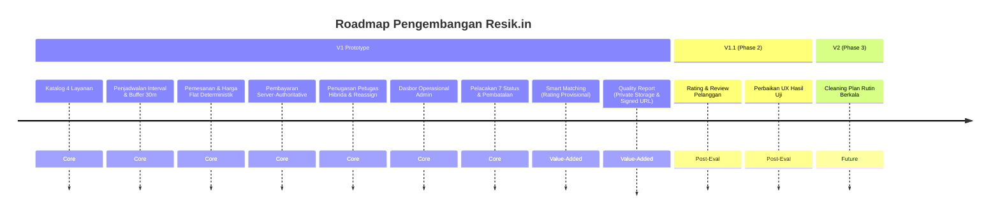

# ROADMAP PENGEMBANGAN PRODUK
## Resik.in — Aplikasi Jasa Kebersihan On-Demand

> **Status Dokumen:** Active Milestone Tracker  
> **Versi Dokumen:** 1.2 (Hardened)  
> **Tanggal Pembaruan:** 26 September 2026  
> **Dokumen Induk:** `docs/PRD-Resik.in.md`, `docs/BUSINESS-RULES.md`  

---

## 1. Ringkasan Pembagian Rilis

Pengembangan sistem Resik.in dibagi menjadi tiga fase berjenjang untuk menjaga fokus implementasi, stabilitas operasional, dan kepatuhan terhadap batasan skripsi:

---

## 2. Rincian Fase Pengembangan

### 2.1 Fase 1: V1 Prototype (In Scope Skripsi Utama)
Fokus: Membuktikan transaksi layanan terstruktur, keandalan alokasi petugas bebas bentrok jadwal, pengamanan data privat, dan akuntabilitas hasil kerja fisik pada antarmuka aplikasi mobile Flutter (Android & iOS) yang didukung oleh Backend REST API (Node.js + Express + Supabase).

- **Fitur Inti (*Core System*):**
  - **FR-01: Katalog Layanan Multi-Kategori** (Pembersihan Rumah, Kos, Kantor, Pasca Renovasi).
  - **FR-02: Penjadwalan Berbasis Interval & Buffer** (Kalkulasi `end_time = start_time + duration`, buffer 30 menit).
  - **FR-03: Pemesanan Layanan, Snapshot Harga Flat Deterministik, & Simulasi Pembayaran Server-Authoritative** (`harga_saat_booking`, `total_biaya = harga_saat_booking`, status bayar awal `Belum Bayar`, simulasi valid via server).
  - **FR-04: Manajemen Data Master Petugas** (Keahlian, pengalaman, foto profil `foto_url`, status operasional administratif: `Aktif`, `Cuti`, `Nonaktif`, serta evaluasi ketersediaan dinamis bebas bentrok jadwal).
  - **FR-05: Penugasan Petugas Hibrida (*Hybrid Assignment*)** (Konfirmasi pilihan pelanggan vs penugasan langsung admin, penolakan bentrok jadwal `409 Conflict`).
  - **FR-06: Manajemen Pesanan, Dasbor Admin, & Reassignment Ber-Audit** (Monitoring order, filter status, assignment, reassignment ber-catatan, cancel, audit log).
  - **FR-07: Pelacakan Progres 7 Status Pekerjaan & Pembatalan Terstruktur** (7 status sekuensial, terminal state pembatalan; Customer tidak dapat membatalkan setelah pekerjaan memasuki tahap lapangan (`Menuju Lokasi`, `Tiba di Lokasi`, `Sedang Dikerjakan`), sedangkan Admin dapat melakukan pembatalan operasional darurat kapan saja sebelum `Selesai`).
  - **FR-08: Manajemen Pengguna & Autentikasi Tunggal Supabase Auth** (Isolasi data peran, tanpa password lokal).
- **Fitur Bernilai Tambah (*Value-Added Features*):**
  - **FR-09: Smart Petugas Matching (*Deterministic Rule-Based*)** (Hard filter ketersediaan & skill, formula skor 40/30/20/10, rating provisional 4.5 untuk petugas baru, pembedaan kartu UI, tie-breaking, fallback tanpa kandidat).
  - **FR-10: Quality Report Digital (*Mandatory Gate to Selesai with Private Storage & Signed URL*)** (Checklist area, foto Before/After diunggah ke private storage bucket, validasi path backend, catatan, 3 timestamp: `started_at`, `completed_at`, `submitted_at`, read-only lock, temporary Signed URL).

---

### 2.2 Fase 2: V1.1 / Phase 2 (Penyempurnaan Pasca-Evaluasi)
Fokus: Menampung umpan balik pelanggan pasca-pekerjaan dan melakukan iterasi pengalaman pengguna.

- **Fitur Baru:**
  - **FR-11: Rating & Ulasan Pelanggan (*Customer Rating & Review*)**
    - Formulir pemberian bintang 1–5 dan ulasan tertulis.
    - Khusus untuk pesanan berstatus `Selesai` yang memiliki Quality Report.
    - Satu ulasan per pesanan (*one review per order*), duplikasi ditolak `409 Conflict`.
    - Kalkulasi otomatis pembaruan reputasi `cleaners.rating_rata_rata`, menggantikan nilai provisional awal.
- **UX & Performance Refinement:**
  - Optimalisasi waktu muat antarmuka berdasarkan metrik uji coba pengguna.
  - Perbaikan navigasi formulir pemesanan (*wizard micro-interactions*).

---

### 2.3 Fase 3: V2 / Phase 3 (Rencana Lanjutan)
Fokus: Retensi pengguna rutin jangka panjang.

- **Fitur Terjadwal:**
  - **FR-12: Cleaning Plan (Paket Pembersihan Rutin Berkala)**
    - Pengaturan jadwal rutin: Mingguan atau Dua Mingguan.
    - Penentuan hari tetap, jam kedatangan rutin, dan preferensi petugas langganan.
    - Generator draf pesanan otomatis H-2 siklus berjalan.
    - Pengelolaan jeda/pembatalan paket langganan oleh pelanggan.

---

## 3. Fitur yang Resmi Ditunda / Out of Scope
Untuk menjaga fokus penyusunan skripsi, fitur berikut **TIDAK DIKERJAKAN** pada seluruh iterasi V1 maupun V1.1:
1. Integrasi Payment Gateway Live (Midtrans/Xendit/Stripe).
2. Chatbot AI Konsultasi Kebutuhan.
3. Pelacakan Koordinat Live GPS pada Peta Interaktif.
4. Modul Penggajian, Komisi, dan Bagi Hasil Petugas (*Payroll*).
5. Formulir Pendaftaran Mandiri Petugas Kebersihan.
6. Manajemen Inventaris Bahan Pembersih Fisik & Akuntansi Perusahaan.
7. Algoritma Machine Learning / Prediktif Berat.
