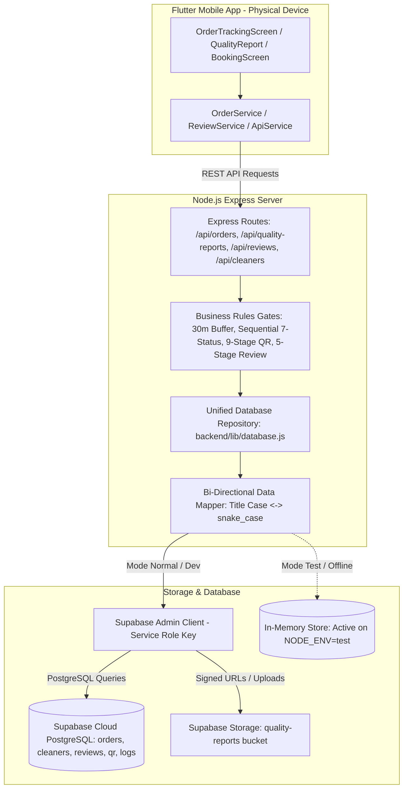

# Design Specification: Full Supabase Cloud Database & Storage Integration

> **Status:** Draft / Approved by Tech Lead  
> **Date:** 2026-10-01  
> **Author:** Antigravity (AI Assistant) & Tech Lead  
> **Target Release:** Phase 2 (V1.1 Architecture Hardening & Real Persistence)  
> **Repository:** Resik.in

---

## 1. Executive Summary & Problem Statement

### 1.1 Background
Pada iterasi awal (Sprint 0–Sprint 4 dan Fase 2 Customer Review), backend Express Resik.in memanfaatkan *in-memory store* dengan persistensi file lokal (`.in_memory_state.json`) untuk mengelola entitas transaksi (`orders`, `status_logs`, `quality_reports`, dan `reviews`). Pendekatan ini memungkinkan 67 skenario *automated test suite* dieksekusi secara sangat cepat dan deterministik tanpa dependensi jaringan. Sementara itu, tabel master katalog (`services`) dan autentikasi (*Google Sign-In*) telah sukses terhubung langsung ke layanan Supabase Cloud.

### 1.2 Objective
Mengintegrasikan seluruh siklus hidup data transaksi Resik.in ke basis data **PostgreSQL Supabase Cloud** yang sesungguhnya secara *server-authoritative* dan persisten:
1. **Database Relasional:** Mengalirkan entitas `orders`, `status_logs`, `cleaners`, `quality_reports`, dan `reviews` ke tabel PostgreSQL Supabase Cloud.
2. **Object Storage:** Memanfaatkan Supabase Storage bucket `quality-reports` untuk menyimpan dokumentasi foto komparasi *Before* dan *After*.
3. **Repository Pattern with Dual-Mode:** Membangun *Data Access Layer* terpusat yang mendukung operasi langsung ke Supabase Cloud pada mode normal/produksi, sekaligus mempertahankan *fail-safe test mode* (`NODE_ENV === 'test'`) agar 67 automated test suite tetap berjalan secepat kilat (~9 detik) dan database cloud bersih dari data uji.
4. **Zero Client Disruption:** Menjamin seluruh kontrak REST API di [docs/API.md](../../API.md) dan model Flutter di [mobile/lib/models/](../../mobile/lib/models/) tetap 100% kompatibel tanpa *breaking changes*.

---

## 2. Arsitektur Sistem & Komponen



---

## 3. Pengelolaan Kredensial & Keamanan (Security Invariants)

### 3.1 Klien Supabase Ganda (`backend/lib/supabase.js`)
Backend Express mengelola dua instansiasi klien Supabase:
1. **`supabase` (Anon Client):** Menggunakan `SUPABASE_ANON_KEY` untuk operasi baca publik yang diizinkan oleh RLS.
2. **`supabaseAdmin` (Admin Client):** Menggunakan `SUPABASE_SERVICE_ROLE_KEY`. Klien ini beroperasi secara eksklusif di backend untuk melakukan mutasi data transaksi (`orders`, `status_logs`, `quality_reports`, `reviews`) tanpa terhambat kebijakan Row Level Security (RLS).

### 3.2 Invarian Keamanan (Non-Negotiable)
Sesuai [docs/SECURITY.md](../../SECURITY.md) dan [AGENTS.md](../../../AGENTS.md):
* **Zero Leakage:** Kunci `SUPABASE_SERVICE_ROLE_KEY` **HANYA BOLEH DISIMPAN DI `backend/.env`**. Kunci ini dilarang keras dikirim ke response JSON, endpoint konfigurasi, atau terekspos ke sisi mobile.
* **Server-Authoritative Validation:** Seluruh validasi hak akses peran (RBAC), pencegahan manipulasi harga, dan gerbang status wajib divalidasi oleh Express middleware sebelum data dikirim ke `supabaseAdmin`.

---

## 4. Lapisan Repositori Data (`backend/lib/database.js`)

Modul repositori ini menyediakan abstraksi antarmuka asinkron yang konsisten:

### 4.1 Interface Methods
```javascript
export const db = {
  // Orders
  createOrder(orderData): Promise<Order>,
  getOrderById(orderId): Promise<Order | null>,
  getOrders(filters): Promise<Order[]>,
  updateOrderStatus(orderId, nextStatus, metadata): Promise<Order>,
  assignCleaner(orderId, cleanerId, auditData): Promise<Order>,
  cancelOrder(orderId, cancelData): Promise<Order>,

  // Cleaners
  getCleaners(): Promise<Cleaner[]>,
  getCleanerById(cleanerId): Promise<Cleaner | null>,
  updateCleanerReputation(cleanerId): Promise<Cleaner>,

  // Quality Reports
  saveQualityReport(reportData): Promise<QualityReport>,
  getQualityReportByOrderId(orderId): Promise<QualityReport | null>,
  uploadQualityReportPhoto(orderId, photoType, buffer, mimeType): Promise<string>,
  getQualityReportSignedUrl(path): Promise<string>,

  // Reviews
  createReview(reviewData): Promise<Review>,
  getReviewsByCleanerId(cleanerId): Promise<Review[]>,
  getReviewByOrderId(orderId): Promise<Review | null>
};
```

### 4.2 Dual-Mode Switching Mechanism
* `isLiveSupabase()` mengevaluasi ketersediaan `SUPABASE_SERVICE_ROLE_KEY` dan nilai `process.env.NODE_ENV !== 'test'`.
* Jika kondisi `true`: Query dialirkan ke PostgreSQL Supabase Cloud.
* Jika kondisi `false` (misal saat `npm test`): Query dialirkan ke adapter `inMemoryStore`.

---

## 5. Penyelarasan Skema & Pemetaan Data (*Bi-directional Mapping*)

### 5.1 Format Status: PostgreSQL *snake_case* $\leftrightarrow$ REST API *Title Case*
Tabel PostgreSQL di Supabase menggunakan konvensi *lower snake_case* yang dibatasi oleh constraint `CHECK`:
* `status_pembayaran`: `'belum_bayar'` $\leftrightarrow$ `'Belum Bayar'`, `'sudah_bayar'` $\leftrightarrow$ `'Sudah Bayar'`.
* `status_pekerjaan`:
  * `'menunggu_konfirmasi'` $\leftrightarrow$ `'Menunggu Konfirmasi'`
  * `'dikonfirmasi'` $\leftrightarrow$ `'Dikonfirmasi'`
  * `'petugas_ditugaskan'` $\leftrightarrow$ `'Petugas Ditugaskan'`
  * `'menuju_lokasi'` $\leftrightarrow$ `'Menuju Lokasi'`
  * `'tiba_di_lokasi'` $\leftrightarrow$ `'Tiba di Lokasi'`
  * `'sedang_dikerjakan'` $\leftrightarrow$ `'Sedang Dikerjakan'`
  * `'selesai'` $\leftrightarrow$ `'Selesai'`
  * `'dibatalkan'` $\leftrightarrow$ `'Dibatalkan'`

*Data Mapper* di repositori secara otomatis mentranslasikan nilai status saat operasi tulis (*write*) dan baca (*read*), sehingga kode UI Flutter tetap menggunakan format teks deskriptif yang ada.

### 5.2 Skema Tambahan Idempoten (Idempotent Schema Alignment)
Untuk memastikan seluruh data operasional tersimpan sempurna di tabel `public.orders`, skrip migrasi memastikan kolom-kolom berikut tersedia:
```sql
ALTER TABLE public.orders ADD COLUMN IF NOT EXISTS duration INT DEFAULT 2;
ALTER TABLE public.orders ADD COLUMN IF NOT EXISTS end_time TIME;
ALTER TABLE public.orders ADD COLUMN IF NOT EXISTS harga_saat_booking NUMERIC(12, 2);
ALTER TABLE public.orders ADD COLUMN IF NOT EXISTS payment_timestamp TIMESTAMPTZ;
ALTER TABLE public.orders ADD COLUMN IF NOT EXISTS started_at TIMESTAMPTZ;
ALTER TABLE public.orders ADD COLUMN IF NOT EXISTS cancellation_reason TEXT;
ALTER TABLE public.orders ADD COLUMN IF NOT EXISTS cancelled_by UUID;
ALTER TABLE public.orders ADD COLUMN IF NOT EXISTS cancelled_at TIMESTAMPTZ;
```

---

## 6. Penanganan Berkas Foto (Supabase Storage: `quality-reports`)

### 6.1 Spesifikasi Bucket
* **Nama:** `quality-reports`
* **Visibilitas:** Private (Non-Public).
* **Maksimum Ukuran File:** 5 MB.
* **Tipe MIME Diizinkan:** `image/jpeg`, `image/png`, `image/webp`.

### 6.2 Alur Pengunggahan & Akses
1. **Upload:** Foto biner diunggah ke storage dengan struktur path: `orders/{order_id}/before.jpg` dan `orders/{order_id}/after.jpg`.
2. **Read / Access:** Saat klien mengakses `GET /api/quality-reports/:order_id`, backend menghasilkan Signed URL berumur 1 jam (3600 detik) via `supabaseAdmin.storage.from('quality-reports').createSignedUrl(path, 3600)`.
3. **Pemberian Izin Otomatis (Self-Provisioning):** Backend memeriksa keberadaan bucket saat startup; jika belum ada, backend otomatis memanggil `createBucket`.

---

## 7. Penegakan Aturan Bisnis Server-Side (Business Rules Preserved)

Semua aturan SOT di [docs/BUSINESS-RULES.md](../../BUSINESS-RULES.md) tetap ditegakkan secara mutlak:
1. **Anti-Double Booking (BR-SCH-001):** Validasi bentrok jadwal petugas dengan buffer 30 menit ($\max(\text{startA}, \text{startB}) < \min(\text{endA} + 30\text{m}, \text{endB} + 30\text{m})$) dihitung di backend sebelum penugasan disimpan ke Supabase.
2. **Siklus 7 Status Sekuensial (BR-ORD-001):** Transisi status tidak boleh melompati tahapan. Status `Menunggu Konfirmasi` $\rightarrow$ `Dikonfirmasi` mewajibkan `status_pembayaran === 'Sudah Bayar'`.
3. **Gerbang Penyelesaian Pekerjaan:** Status `Sedang Dikerjakan` hanya dapat berpindah ke `Selesai` melalui pengiriman Laporan Mutu yang lolos validasi 9-tahap.
4. **Pencegahan Ulasan Duplikat (BR-REV-001):** Ulasan hanya dapat dikirim jika pesanan `Selesai`, pengulas adalah pemilik pesanan asli, dan belum pernah diulas sebelumnya (`409 Conflict`).
5. **Audit Logging:** Setiap perubahan status menghasilkan catatan baru di tabel `public.status_logs`.

---

## 8. Rencana Pengujian & Kriteria Keberhasilan (Verification Strategy)

### 8.1 Automated Regression Testing
* **Backend:** Menjalankan `npm test` dengan hasil **67/67 tests lulus** (0 failures).
* **Mobile Unit & Widget Tests:** Menjalankan `flutter test` dengan hasil **48/48 tests lulus** (0 failures).
* **Static Analysis:** Menjalankan `flutter analyze` dengan hasil **0 issues**.

### 8.2 End-to-End Live Verification (Physical Device)
* Menghubungkan perangkat fisik Samsung Galaxy A52 (SM-A525F) melalui port forwarding ADB (`adb reverse tcp:3000 tcp:3000`).
* Menjalankan skenario pemesanan lengkap:
  1. Pembuatan pesanan baru $\rightarrow$ Baris baru terbuat di tabel `public.orders` Supabase Cloud.
  2. Pembayaran simulasi $\rightarrow$ Kolom `status_pembayaran` ter-update menjadi `sudah_bayar` di Supabase.
  3. Penugasan petugas $\rightarrow$ Petugas tercatat dan jadwal tervalidasi bebas bentrok.
  4. Pengiriman Laporan Mutu $\rightarrow$ Foto tersimpan di Supabase Storage bucket `quality-reports` dan record tersimpan di `public.quality_reports`.
  5. Pengiriman Rating & Ulasan $\rightarrow$ Ulasan masuk ke `public.reviews`, dan rating petugas di `public.cleaners` ter-update.
