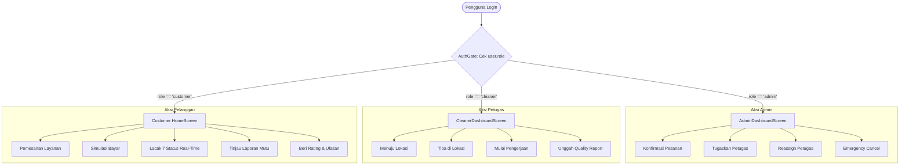

# Spesifikasi Desain: Multi-Role Dedicated Dashboards (Admin, Cleaner, Customer) & Penghapusan Simulasi Operasional

> **Dokumen:** `docs/superpowers/specs/2026-10-04-multi-role-dashboard-design.md`  
> **Status:** Approved Architecture Specification (PM & Senior Software Engineer Hardened)  
> **Tanggal:** 04 Oktober 2026  
> **Target Rilis:** Sprint 6 — Production-Grade Multi-Role Architecture  
> **Referensi SOT:** `docs/PRD-Resik.in.md`, `docs/ARCHITECTURE.md`, `docs/BUSINESS-RULES.md`, `docs/API.md`, `docs/SECURITY.md`, `database/schema.sql`

---

## 1. Latar Belakang, Problem Statement, & Urgensi Produk

### 1.1 Kondisi Saat Ini (Current State)
Pada Milestone V1 dan V1.1 (Sprint 0 s.d. Sprint 5), seluruh logika backend REST API dan aturan bisnis mutlak telah selesai diimplementasikan secara *server-authoritative* dan terhubung langsung ke **Supabase Cloud (PostgreSQL & Storage)**:
- **Backend REST API**: Endpoint konfirmasi admin (`PATCH /api/orders/:id/status`), penugasan petugas (`POST /api/orders/:id/assign`), pembaruan status lapangan sekuensial (`PATCH /api/orders/:id/status`), dan pengiriman pelaporan mutu digital (`POST /api/quality-reports`) sudah berstatus *real API* dan dilindungi aturan RBAC serta validasi status.
- **Frontend Mobile (Flutter)**: Gerbang navigasi (`AuthGate`) saat ini masih mengarahkan semua pengguna ke layar beranda Pelanggan (`HomeScreen`). Untuk memfasilitasi pengujian alur 7 tahapan siklus hidup pesanan, sebuah lembar bantuan sementara bernama **"Simulasi Operasional"** (`OperationalSimulationSheet`) disematkan mengambang di layar pelacakan pesanan pelanggan (`OrderTrackingScreen`).

### 1.2 Masalah yang Dipecahkan (Problem Statement)
1. **Ketidaksesuaian Pengalaman Pengguna (UX Inconsistency)**: Pelanggan tidak seharusnya memiliki wewenang atau tombol di antarmukanya untuk mengonfirmasi pesanan sendiri, memilih petugas sendiri secara bebas, atau mengubah status fisik lapangan menjadi "Tiba di Lokasi" dan mengirim foto mutu pengerjaan.
2. **Kebutuhan Bobot Pembahasan Skripsi (Production-Grade Architecture)**: Pada sidang skripsi rekayasa perangkat lunak, sistem aplikasi *on-demand* dinilai jauh lebih matang dan memenuhi standar industri (*production-ready*) apabila memiliki pembagian antarmuka berbasis peran (*Role-Based UI*) yang terpisah dan mencerminkan interaksi nyata antara 3 aktor utama:
   - **Pelanggan (Customer)**: Memesan, membayar, melacak status real-time, melihat laporan mutu, dan memberi ulasan.
   - **Petugas Lapangan (Cleaner)**: Menerima penugasan, navigasi ke lokasi hunian, memperbarui status kedatangan/pengerjaan, dan mengunggah bukti mutu (*Quality Report*).
   - **Administrator (Admin)**: Menara pengawas operasional (*Control Tower*), konfirmasi pesanan lunas, penugasan cerdas (*Smart Matching*) anti-double booking, *reassignment* ber-alasan audit, dan pembatalan darurat.

### 1.3 Tujuan Desain (Design Objectives)
1. **Declarative Role-Based Routing**: Mengarahkan pengguna secara otomatis ke dasbor yang sesuai dengan perannya (`customer`, `cleaner`, atau `admin`) saat membuka aplikasi atau berhasil login.
2. **Cleaner Dedicated Dashboard**: Menyediakan antarmuka lapangan ergonomis bagi petugas kebersihan untuk melihat tugas aktif hari ini, memicu transisi status fisik lapangan, dan mengisi dokumen *Quality Report* (foto Before/After & checklist verifikasi).
3. **Admin Operational Control Tower**: Menyediakan antarmuka monitoring komprehensif bagi admin untuk memverifikasi pesanan lunas, menugaskan petugas secara cerdas (*Smart Matching*) bebas bentrok jadwal, melakukan *reassignment* ber-audit, dan pembatalan darurat.
4. **Pembersihan Antarmuka Pelanggan**: Menghapus seluruh tombol simulasi dari antarmuka pelanggan sehingga pelanggan murni menerima pembaruan status nyata (*real-time/short-polling*) dan mengisi ulasan pasca-selesai.
5. **Fleksibilitas Pengujian Sidang Skripsi**: Menyediakan mekanisme *Role Switcher* terisolasi berlabel demo di tab Akun agar penguji dapat mengevaluasi 3 peran berbeda dengan mudah pada satu perangkat ponsel.

### 1.4 Kriteria Keberterimaan Produk (Product Acceptance Criteria)
| ID AC | Modul / Aktor | Skenario Pengujian (Given - When - Then) | Hasil yang Diharapkan |
| :--- | :--- | :--- | :--- |
| **AC-AUTH-01** | Navigasi / `AuthGate` | **Given** pengguna login dengan profil `role == 'admin'`<br>**When** aplikasi memuat `AuthGate`<br>**Then** halaman yang dirender adalah `AdminDashboardScreen`. | Pengguna masuk langsung ke menara kontrol operasional tanpa melewati halaman pelanggan. |
| **AC-AUTH-02** | Navigasi / `AuthGate` | **Given** pengguna login dengan profil `role == 'cleaner'`<br>**When** aplikasi memuat `AuthGate`<br>**Then** halaman yang dirender adalah `CleanerDashboardScreen`. | Pengguna langsung melihat daftar tugas lapangan aktif miliknya. |
| **AC-ADM-01** | Admin / Konfirmasi | **Given** pesanan berstatus `Menunggu Konfirmasi` dengan `status_pembayaran == 'Belum Bayar'`<br>**When** Admin membuka tab "Butuh Tindakan"<br>**Then** tombol "Konfirmasi Pesanan" terkunci (*disabled*) dengan teks *"Menunggu Pembayaran Pelanggan"*. | Mencegah pelanggaran aturan bisnis *BR-FIN-001*. |
| **AC-ADM-02** | Admin / Penugasan | **Given** pesanan `Dikonfirmasi` dan petugas A mengalami bentrok jadwal (irisan waktu + buffer 30 mnt)<br>**When** Admin membuka `SmartAssignmentSheet`<br>**Then** petugas A ditandai badge merah *"Jadwal Bentrok"* dan tombol pemilihannya dinonaktifkan. | Mencegah *double booking* jadwal petugas secara visual dan *server-side*. |
| **AC-CLN-01** | Cleaner / Progres | **Given** pesanan berstatus `Petugas Ditugaskan`<br>**When** Petugas menekan tombol "Mulai Berangkat"<br>**Then** status pesanan bertransisi menjadi `Menuju Lokasi` dan tombol berikutnya berubah menjadi "Saya Sudah Tiba di Lokasi". | Transisi status lapangan terjadi berurutan tanpa loncat tahap (*BR-STS-001*). |
| **AC-CLN-02** | Cleaner / Quality Report | **Given** pesanan berstatus `Sedang Dikerjakan`<br>**When** Petugas menyelesaikan pekerjaan dan menekan "Kirim Laporan Mutu"<br>**Then** form `QualityReportScreen` terbuka, memvalidasi foto Before/After, checklist, dan mengubah status menjadi `Selesai`. | Gerbang status `Selesai` hanya dapat ditembus melalui dokumen mutu (*BR-QRP-001*). |
| **AC-CUST-01** | Customer / Pelacakan | **Given** pelanggan membuka layar pelacakan `OrderTrackingScreen`<br>**When** Admin atau Petugas memperbarui status di dasbor masing-masing<br>**Then** dalam maksimal 10 detik atau saat *Pull-to-Refresh*, stepper bergerak maju secara otomatis tanpa tombol simulasi. | Pengalaman pelanggan murni mencerminkan aplikasi konsumen profesional. |

---

## 2. Arsitektur Peran & Navigasi Sistem (`AuthGate`)

### 2.1 Alur Deteksi Peran & Pemetaan Identitas (*Identity Linking*)
Sesuai rancangan basis data Supabase:
- Tabel `public.profiles` menyimpan atribut `role VARCHAR(20)` (`'customer'`, `'cleaner'`, `'admin'`).
- Tabel `public.cleaners` menyimpan data profil operasional petugas lapangan dan memiliki relasi opsional `user_id UUID REFERENCES public.profiles(id)`.



### 2.2 Penanganan Khusus Petugas (*Cleaner Context*)
Saat pengguna dengan `role: 'cleaner'` login:
1. Model `UserModel` di Flutter diperluas dengan properti `final String? cleanerId`.
2. Saat aplikasi melakukan inisialisasi sesi (`AuthService`), jika `user.role == 'cleaner'`:
   - Frontend memanggil `GET /api/cleaners` atau memeriksa relasi `cleaners.user_id == user.id`.
   - Menautkan ID operasional cleaner (`cleanerId`) ke sesi aktif.
3. `CleanerDashboardScreen` memanfaatkan `cleanerId` ini untuk mengambil daftar tugas aktif:
   `GET /api/orders?cleaner_id={cleanerId}`.

### 2.3 Kontrak Header HTTP Global & Otorisasi RBAC
Untuk memastikan seluruh request API menyertakan kredensial identitas yang konsisten, `AuthService` menyediakan getter header terpusat:
```dart
Map<String, String> get authHeaders => {
  'Content-Type': 'application/json',
  if (currentUser != null) 'x-user-id': currentUser!.id,
  if (currentUser != null) 'x-user-role': currentUser!.role,
  if (currentUser?.cleanerId != null) 'x-cleaner-id': currentUser!.cleanerId!,
};
```
Backend Express.js secara *server-authoritative* memvalidasi header ini untuk menerapkan isolasi peran pada `GET /api/orders`, `PATCH /api/orders/:id/status`, dan `POST /api/orders/:id/assign`.

### 2.4 Reaktivitas State `AuthService` & Role Switcher (Khusus Demonstrasi Evaluasi Skripsi)
- `AuthService` mengimplementasikan pola `ChangeNotifier` atau mengekspos `Stream<UserModel?>` sehingga pemanggilan `switchRole(...)` secara instan memicu `notifyListeners()` pada `AuthGate`.
- Pengguna/Penguji sidang dapat berpindah mode seketika melalui menu ekspansi **"Mode Evaluasi Skripsi (Role Switcher)"** di tab Akun:
  - Mode Pelanggan (`Customer - Demo User`)
  - Mode Petugas Lapangan (`Cleaner - Cecep` dengan `cleanerId` tertaut)
  - Mode Administrator (`Admin Operasional`)
- **Senior Software Engineer Safeguard**:
  - Perpindahan peran memperbarui memori sesi `currentUser` dan header HTTP tanpa me-restart aplikasi.
  - Seluruh pembatasan akses server-side (Express RBAC & Supabase RLS) tetap berjalan 100% valid sesuai identitas peran yang aktif.

---

## 3. Spesifikasi Dasbor Petugas (*Cleaner Dashboard*)

### 3.1 Komponen & Tata Letak Layar (`CleanerDashboardScreen`)
Layar didesain khusus untuk penggunaan operasional lapangan dengan satu tangan (*one-handed mobile operation*):
1. **Header Profil Petugas**:
   - Avatar / inisial nama petugas.
   - Nama petugas & badge status operasional (`Aktif` hijau atau `Sedang Bertugas` biru).
   - Rating rata-rata aktual (bintang) dan total pekerjaan selesai.
   - Chip kategori keahlian layanan (`Rumah`, `Kos`, `Kantor`, `Pasca Renovasi`).
2. **Kartu Metrik Harian Ringkas**:
   - Jumlah tugas aktif yang sedang berjalan.
   - Total pesanan yang tuntas dikerjakan.
3. **Tab Navigasi Pekerjaan**:
   - **Tab 1: Tugas Berjalan (*Active Task*)**:
     - Menampilkan kartu pesanan aktif yang ditugaskan kepada dirinya (`Petugas Ditugaskan`, `Menuju Lokasi`, `Tiba di Lokasi`, `Sedang Dikerjakan`).
     - Menyajikan informasi lapangan lengkap: Alamat hunian pelanggan, patokan lokasi, tombol cepat **"Buka Navigasi / Peta"**, jadwal kedatangan, durasi layanan, luas area, dan catatan khusus hunian.
   - **Tab 2: Riwayat Pekerjaan (*Completed History*)**:
     - Daftar pesanan berstatus `Selesai` yang pernah dikerjakan oleh petugas ini.
     - Menampilkan rating bintang dan ulasan testimoni dari pelanggan serta tombol untuk melihat kembali arsip foto *Quality Report*.

### 3.2 Alur Aksi Bertahap Lapangan (*Sequential Field Progression*)
Tombol aksi lapangan di kartu tugas aktif berevolusi secara sekuensial mutlak sesuai *finite-state machine*:
1. **Saat status `Petugas Ditugaskan`**:
   - Tombol: **"Mulai Berangkat (Menuju Lokasi)"** $\rightarrow$ Request `PATCH /api/orders/:id/status` dengan `status_baru: 'Menuju Lokasi'`.
2. **Saat status `Menuju Lokasi`**:
   - Tombol: **"Saya Sudah Tiba di Lokasi"** $\rightarrow$ Request `PATCH /api/orders/:id/status` dengan `status_baru: 'Tiba di Lokasi'`.
3. **Saat status `Tiba di Lokasi`**:
   - Tombol: **"Mulai Pengerjaan"** $\rightarrow$ Request `PATCH /api/orders/:id/status` dengan `status_baru: 'Sedang Dikerjakan'`.
4. **Saat status `Sedang Dikerjakan`**:
   - Tombol Utama: **"Tuntaskan & Buat Laporan Mutu (Quality Report)"** $\rightarrow$ Membuka form `QualityReportScreen`.

### 3.3 Penanganan Kondisi Nir-Data (*Zero-Data & Empty State UX*)
- Jika petugas tidak memiliki tugas aktif hari ini:
  - Ditampilkan kartu ilustrasi ramah:
    *"Belum ada tugas aktif saat ini. Anda sedang dalam status siaga (Aktif). Tarik layar ke bawah untuk memeriksa pesanan baru."*
- Jika riwayat tugas masih kosong:
  - Ditampilkan pesan edukatif: *"Riwayat pekerjaan Anda akan dicatat di sini setelah Anda menyelesaikan laporan mutu pekerjaan pertama Anda."*

### 3.4 Ketahanan Lapangan & Deep-Link Navigasi Peta
1. **Deep-Link Peta dengan Robust Fallback**:
   - Tombol "Buka Navigasi / Peta" mencoba meluncurkan skema peta native:
     `geo:0,0?q=${Uri.encodeComponent(alamat)}`.
   - Jika aplikasi peta native tidak terinstal, secara otomatis beralih ke URL web browser:
     `https://www.google.com/maps/search/?api=1&query=${Uri.encodeComponent(alamat)}` menggunakan `LaunchMode.externalApplication`.
2. **Pencegahan Mutasi Ganda (*Double-Tap Debouncing*)**:
   - Seluruh tombol aksi transisi status lapangan dinonaktifkan secara visual (*disabled state*) dan menampilkan *CircularProgressIndicator* mini saat panggilan jaringan sedang berlangsung.
3. **Kompresi Gambar Sisi Klien & Retensi Formulir**:
   - Foto kamera/galeri otomatis dikompresi menjadi format JPEG/WebP dengan ukuran 1–2 MB sebelum diunggah ke Supabase Storage bucket `quality-reports`.
   - Jika koneksi internet terputus saat proses pengiriman Quality Report, berkas foto yang telah dipilih dan centang checklist tidak akan hilang dari layar. Tombol otomatis berubah menjadi mode **"Coba Kirim Ulang (*Retry*)"**.

---

## 4. Spesifikasi Dasbor Administrator (*Admin Dashboard*)

### 4.1 Komponen & Tata Letak Layar (`AdminDashboardScreen`)
Dasbor ini berfungsi sebagai **Menara Pengawas Operasional (*Operational Control Tower*)**:
1. **Header & Pipeline Counter Badges**:
   - Menampilkan rekapitulasi jumlah pesanan secara visual:
     - 🟡 **Perlu Konfirmasi** (Pesanan baru masuk, status bayar `Sudah Bayar`).
     - 🔵 **Perlu Petugas** (Pesanan berstatus `Dikonfirmasi`, belum ada petugas).
     - 🟢 **Sedang Berjalan** (Tahap lapangan: Menuju, Tiba, Dikerjakan).
     - ⚪ **Tuntas** (Status `Selesai`).
     - 🔴 **Dibatalkan** (Status `Dibatalkan`).
2. **Tab Navigasi Operasional**:
   - **Tab 1: Butuh Tindakan Segera (*Action Required*)**:
     - Khusus mengumpulkan pesanan yang memerlukan keputusan Admin:
       - Pesanan `Menunggu Konfirmasi`: Jika `status_pembayaran == 'Sudah Bayar'`, tombol **"Konfirmasi Pesanan"** aktif. Jika `Belum Bayar`, tombol terkunci dengan badge abu-abu *"Menunggu Pembayaran Pelanggan"* (*BR-FIN-001*).
       - Pesanan `Dikonfirmasi`: Tombol **"Tugaskan Petugas (Smart Matching)"** aktif.
   - **Tab 2: Monitoring Lapangan (*Live Monitoring*)**:
     - Mengawasi seluruh pesanan yang sedang berjalan di lapangan secara real-time.
     - Menyediakan tombol aksi mitigasi: **"Ganti Petugas (*Reassign*)"** jika petugas berhalangan, atau **"Batalkan Pesanan Darurat"** jika terjadi insiden di lapangan.
   - **Tab 3: Tim Petugas (*Cleaner Roster*)**:
     - Menampilkan daftar seluruh petugas kebersihan, status operasional saat ini (`Aktif`, `Sedang Bertugas`, `Cuti`), rating performa, dan keahlian kategori layanan.

### 4.2 Modal Cerdas Penugasan Petugas (`SmartAssignmentSheet`)
Saat Admin menekan tombol *"Tugaskan Petugas"*:
- Menampilkan modal pemilihan petugas yang diurutkan secara deterministik oleh **Algoritma Smart Matching (SOT Sprint 2)**:
  - Skor Total: 40% Ketersediaan Jadwal, 30% Keahlian, 20% Rating, 10% Pengalaman.
  - Pembedaan badge visual: Petugas preferensi awal pelanggan ditandai badge *"Pilihan Pelanggan"*.
  - **Pencegahan Double Booking Visual**: Petugas yang mengalami bentrok jadwal (irisan waktu pesanan lain + buffer 30 menit) otomatis diberi tanda merah **"Jadwal Bentrok"** dan tombol pemilihannya terkunci (*disabled*).
- Admin memilih petugas $\rightarrow$ memanggil `POST /api/orders/:id/assign`. Status pesanan berubah menjadi `Petugas Ditugaskan`.

### 4.3 Audit Integritas pada Reassign & Pembatalan Darurat
- Sesuai aturan *BR-ASN-003* dan *BR-STS-003*, form modal penggantian petugas (*Reassign*) dan pembatalan (*Cancel*) wajib menyertakan kolom input teks alasan (minimal 5 karakter, misal: *"Petugas sakit mendadak"*).
- Alasan pembatalan/penggantian disimpan permanen pada tabel `status_logs` untuk auditabilitas operasional.

### 4.4 Efisiensi Pengambilan Data Paralel (*Parallel Data Fetching*)
- Layar Admin menggunakan `Future.wait([orderService.getOrders(), cleanerService.getCleaners()])` untuk memangkas *network latency* hingga 50% dibandingkan pemanggilan berurutan (*sequential waterfall*).

### 4.5 Penanganan Kondisi Nir-Data Admin (*Zero-Data UX*)
- Jika tab "Butuh Tindakan" kosong:
  - Ditampilkan kartu status hijau tenang:
    *"Operasional Terkendali. Tidak ada pesanan yang memerlukan konfirmasi pembayaran atau penugasan petugas saat ini."*

---

## 5. Pembersihan Antarmuka Pelanggan (*Customer UI Cleanup*)

### 5.1 Penghapusan Widget Bantuan Simulasi
1. Widget tombol mengambang `OperationalSimulationSheet` pada [`mobile/lib/screens/order_tracking_screen.dart`](file:///c:/Users/62859/Documents/Skripsi/Resik.in/mobile/lib/screens/order_tracking_screen.dart) **dihapus secara permanen**.
2. Seluruh dependensi simulasi operasional di sisi pelanggan dinonaktifkan, sehingga antarmuka pelanggan murni menjadi antarmuka konsumen (*pure consumer experience*).

### 5.2 Mekanisme Pembaruan Status Pelanggan (*Adaptive Polling & Pull-to-Refresh*)
Karena prototipe ini berjalan pada arsitektur HTTP REST API (tanpa WebSocket server yang membebani resource), pelacakan status pesanan di sisi pelanggan menggunakan strategi **Dual Synchronization**:
1. **Manual Pull-to-Refresh**:
   - Layar pelacakan dibungkus dengan `RefreshIndicator` dan tombol refresh di `AppBar` agar pengguna dapat memicu pembaruan status kapan saja.
2. **Adaptive Short-Polling with Lifecycle Awareness**:
   - Selama pesanan berstatus aktif (`Menunggu Konfirmasi`, `Dikonfirmasi`, `Petugas Ditugaskan`, `Menuju Lokasi`, `Tiba di Lokasi`, `Sedang Dikerjakan`), sebuah timer ringan melakukan polling setiap **10 detik**.
   - **Senior Software Engineer Safeguard**:
     - Polling otomatis dihentikan (*cancel timer*) saat pesanan mencapai status terminal (`Selesai` atau `Dibatalkan`).
     - Polling otomatis dihentikan saat layar di-`dispose()` (pengguna keluar dari halaman pelacakan) atau saat aplikasi diminimalkan ke latar belakang (*AppLifecycleState.paused*) dengan mendaftarkan `WidgetsBindingObserver`.
3. **Retensi Tampilan Optimistik (*Optimistic View Retention*)**:
   - Jika terjadi kegagalan jaringan saat polling berlangsung, UI tidak akan mengosongkan layar (*no blank screen*). State terakhir stepper 7 tahapan tetap ditampilkan, disertai pemberitahuan *SnackBar* halus di bagian bawah.

### 5.3 Pemicu Aksi Pasca-Selesai (*Seamless Post-Completion Trigger*)
Saat status pesanan terdeteksi telah berubah menjadi `Selesai`:
1. Stepper tahapan otomatis menandai seluruh 7 langkah dengan centang hijau tuntas.
2. Kartu kesimpulan menampilkan dua tombol aksi utama:
   - **"Lihat Laporan Mutu (Quality Report)"**: Membuka modal ringkasan laporan mutu (foto Before/After, checklist, dan catatan petugas).
   - **"Beri Rating & Ulasan"**: Membuka modal ulasan pelanggan bintang 1-5 dan testimoni (jika `has_reviewed == false`). Jika ulasan telah dikirim (`has_reviewed == true`), tombol berubah menjadi badge bintang ulasan yang telah diberikan.

---

## 6. Penanganan Kondisi Batas & Konflik Antar Aktor (*Edge Cases & Race Conditions*)

| Skenario Konflik | Perilaku Backend | Respons Frontend Mobile | Pengalaman Pengguna (UX) |
| :--- | :--- | :--- | :--- |
| **Kasus 1: Reassign Petugas saat Pelanggan Melacak** | Backend mencatat pergantian petugas di `orders.cleaner_id` & `status_logs`. | Saat polling 10 detik berikutnya atau saat refresh, `OrderTrackingScreen` mendeteksi perubahan `cleaner_id`. | Kartu profil petugas di layar pelanggan berganti ke nama & foto petugas baru secara mulus. |
| **Kasus 2: Cleaner Memperbarui Status Pesanan yang Dibatalkan Admin** | Backend menolak request dengan status HTTP 400 (`INVALID_STATUS_TRANSITION`). | `CleanerDashboardScreen` menangkap error code tersebut. | Tampil dialog peringatan: *"Pesanan ini telah dibatalkan oleh Admin/Pelanggan."* Kartu tugas otomatis dihapus dari tab aktif. |
| **Kasus 3: Pelanggan Membayar saat Admin Membuka Tab Tindakan** | Backend memperbarui `status_pembayaran = 'Sudah Bayar'` via `POST /api/orders/:id/pay`. | Saat Admin menarik layar (*Pull-to-Refresh*), data terbaru dimuat. | Badge pesanan berubah menjadi kuning aktif, tombol "Konfirmasi Pesanan" terbuka untuk diklik. |
| **Kasus 4: Gangguan Jaringan saat Upload Quality Report** | Supabase Storage gagal menerima file multipart. | Form `QualityReportScreen` mempertahankan data foto & checklist di memori. | Tampil tombol **"Coba Kirim Ulang (Retry)"** tanpa memaksa petugas mengulang foto dari awal. |

---

## 7. Skenario Demonstrasi Sidang Skripsi (*Golden Path Walkthrough*)

Untuk memberikan kesan profesional dan sistematis saat demonstrasi di depan dosen penguji skripsi, urutan demo dijalankan sebagai berikut:

```
[LANGKAH 1: PELANGGAN]
1. Buka aplikasi Resik.in (Role: Customer).
2. Buat pesanan baru layanan Bersih Rumah (Jadwal besok 09:00 WIB, durasi 2 jam).
3. Lakukan simulasi pembayaran -> Status: "Menunggu Konfirmasi".
4. Buka layar pelacakan (OrderTrackingScreen).

[LANGKAH 2: ADMINISTRATOR]
1. Buka tab Akun -> Role Switcher -> Pilih "Administrator".
2. Aplikasi otomatis membuka AdminDashboardScreen.
3. Tab "Butuh Tindakan": Lihat pesanan baru yang sudah lunas.
4. Klik tombol "Konfirmasi Pesanan" -> Status: "Dikonfirmasi".
5. Klik tombol "Tugaskan Petugas" -> SmartAssignmentSheet terbuka.
6. Tunjukkan urutan rekomendasi cerdas dan penanda bentrok jadwal.
7. Pilih petugas "Cecep" -> Status: "Petugas Ditugaskan".

[LANGKAH 3: PETUGAS LAPANGAN]
1. Buka tab Akun -> Role Switcher -> Pilih "Cleaner (Cecep)".
2. Aplikasi otomatis membuka CleanerDashboardScreen.
3. Tab "Tugas Aktif": Tunjukkan kartu tugas yang baru ditugaskan.
4. Tunjukkan tombol navigasi peta lokasi pelanggan.
5. Klik "Mulai Berangkat" -> Status: "Menuju Lokasi".
6. Klik "Saya Sudah Tiba di Lokasi" -> Status: "Tiba di Lokasi".
7. Klik "Mulai Pengerjaan" -> Status: "Sedang Dikerjakan".
8. Klik "Tuntaskan & Buat Laporan Mutu" -> Form QualityReportScreen terbuka.
9. Ambil/pilih foto Before & After, centang checklist mutu -> Kirim Laporan Mutu -> Status: "Selesai".

[LANGKAH 4: VERIFIKASI PELANGGAN & ULASAN]
1. Buka tab Akun -> Role Switcher -> Pilih kembali "Customer".
2. Buka pesanan aktif -> Tunjukkan bahwa status sudah otomatis "Selesai".
3. Klik "Lihat Laporan Mutu" -> Tunjukkan foto Before/After pengerjaan petugas Cecep.
4. Klik "Beri Rating & Ulasan" -> Berikan bintang 5 dan ulasan pujian -> Kirim Ulasan.
5. Selesai (Siklus hidup 7 status tertutup sempurna).
```

---

## 8. Skema Database & Data Linking (SQL Migration)

Untuk memastikan data petugas kebersihan terhubung dengan akun profil Supabase:
```sql
-- Memastikan kolom user_id tersedia di tabel public.cleaners
ALTER TABLE public.cleaners 
ADD COLUMN IF NOT EXISTS user_id UUID REFERENCES public.profiles(id) ON DELETE SET NULL;

-- Memastikan indeks pencarian cepat untuk query berbasis user_id
CREATE INDEX IF NOT EXISTS idx_cleaners_user_id ON public.cleaners(user_id);

-- Menautkan cleaner Cecep ke profil cleaner aktif untuk keperluan demonstrasi
UPDATE public.cleaners 
SET user_id = 'c1eane11-0000-4000-a000-000000000001' 
WHERE nama = 'Cecep' AND user_id IS NULL;
```

---

## 9. Rencana Pengujian Otomatis & Verifikasi (*Testing Matrix*)

Pengujian otomatis wajib lulus 100% tanpa regresi:
1. **Unit & Widget Test Dashboard Baru**:
   - `cleaner_dashboard_test.dart`: Memastikan Cleaner Dashboard menampilkan tugas aktif, memicu transisi status sekuensial lapangan, dan menampilkan form Quality Report.
   - `admin_dashboard_test.dart`: Memastikan Admin Dashboard menampilkan counter ringkasan, mengunci konfirmasi jika belum bayar, membuka Smart Matching modal, dan menolak double booking.
   - `auth_gate_role_test.dart`: Memastikan `AuthGate` merender `AdminDashboardScreen` untuk admin, `CleanerDashboardScreen` untuk cleaner, dan `HomeScreen` untuk customer.
2. **Regression Check Backend (`npm test`)**: Memastikan seluruh 86 automated backend tests tetap lulus 100%.
3. **Regression Check Mobile (`flutter test` & `flutter analyze`)**: Memastikan seluruh unit & widget tests lulus dan 0 issues pada static analysis.
4. **Verifikasi Perangkat Fisik (Samsung Galaxy A52)**: Build APK terbaru dan pengujian alur lengkap 3 peran di ponsel nyata via Wireless ADB.

---

## 10. Rencana Struktur Berkas Proyek

```text
mobile/lib/
├── models/
│   └── user_model.dart                   # [DIUBAH] Menambahkan properti cleanerId
├── screens/
│   ├── admin_dashboard_screen.dart       # [BARU] Dasbor monitoring & penugasan Admin
│   ├── cleaner_dashboard_screen.dart     # [BARU] Dasbor operasional lapangan Petugas
│   ├── order_tracking_screen.dart        # [DIUBAH] Pembersihan simulasi & penambahan adaptive polling
│   └── ... (screens lainnya tetap)
├── widgets/
│   ├── smart_assignment_sheet.dart       # [BARU] Modal pemilihan petugas ber-algoritma
│   ├── role_switcher_drawer.dart         # [BARU/MODULAR] Modul pergantian peran untuk evaluasi sidang
│   ├── operational_simulation_sheet.dart # [DIHAPUS/DEPRECATED] Digantikan oleh dashboard asli
│   └── ... (widgets lainnya tetap)
└── main.dart                             # [DIUBAH] Role-based routing di AuthGate
```
