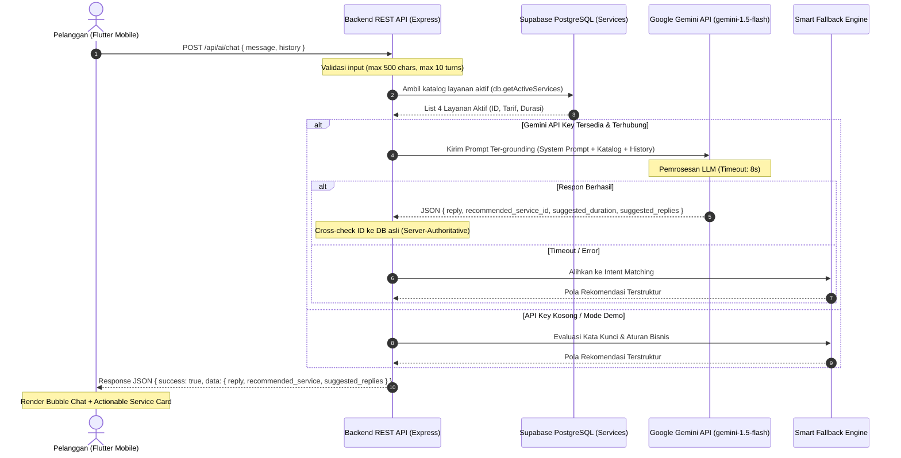

# Spesifikasi Desain: Chatbot AI Konsultasi Kebutuhan & Asisten Pemesanan Pintar (Resik AI)

> **Dokumen:** `docs/superpowers/specs/2026-10-10-ai-consultation-chatbot-design.md`  
> **Status:** Approved Architecture Specification (PM & Senior Software Engineer Hardened)  
> **Tanggal:** 10 Oktober 2026  
> **Target Rilis:** Phase 2.5 / V1.2 — Intelligent Conversational Commerce Subsistem  
> **Referensi SOT:** `docs/PRD-Resik.in.md`, `docs/ARCHITECTURE.md`, `docs/BUSINESS-RULES.md`, `docs/API.md`, `docs/SECURITY.md`, `database/schema.sql`

---

## 1. Latar Belakang, Problem Statement, & Urgensi Produk

### 1.1 Kondisi Saat Ini (*Current State*)
Pada arsitektur Resik.in V1 s.d. V1.1:
- Pelanggan memilih layanan dari katalog statis (Pembersihan Rumah, Kos, Kantor, Pasca Renovasi).
- Pelanggan sering kali merasa ragu mengenai:
  1. Jenis layanan apa yang paling tepat untuk masalah hunian mereka (misal: kos berdebu tebal vs rumah tipe 36 vs noda pasca perbaikan).
  2. Berapa alokasi durasi yang harus dipilih di formulir pemesanan.
  3. Bagaimana ketentuan operasional (jam layanan, garansi mutu, dan ketersediaan peralatan).
- Di Beranda aplikasi mobile Flutter (`main.dart`), sudah terdapat kartu visual bertuliskan **"Tanya Resik AI"**, namun elemen tersebut masih bersifat statis dan belum memiliki logika interaksi.

### 1.2 Masalah yang Dipecahkan (*Problem Statement*)
1. **Friksi Pengambilan Keputusan (*Decision Paralysis*)**: Calon pelanggan baru sering ragu memilih paket dan mengestimasi durasi yang tepat, yang berpotensi menyebabkan pembatalan niat pesan (*drop-off*).
2. **Kebutuhan Layanan Terpadu (*Customer Care & Sales Concierge*)**: Memisahkan layanan bantuan (*FAQ*) dengan formulir pemesanan membuat pengguna harus berpindah-pindah layar secara manual.
3. **Nilai Kebaruan & Bobot Skripsi (*Academic & Innovation Value*)**: Integrasi kecerdasan buatan generatif (*Generative AI / LLM*) yang ter-orkestrasi secara aman di sisi backend (*server-authoritative*) dengan *grounding* data katalog riil dan fallback deterministik memberikan kontribusi kebaruan fungsional yang kuat untuk pengujian sidang skripsi.

### 1.3 Tujuan Desain (*Design Objectives*)
1. **AI Concierge Dual-Role**: Menggabungkan peran *Customer Care* (menjawab FAQ, jam kerja, garansi mutu) dan *Sales Consultant* (menganalisis kondisi hunian, menyarankan durasi dan paket yang tepat).
2. **Actionable In-Chat Service Cards**: Menampilkan kartu layanan interaktif di dalam bubble percakapan yang dapat langsung diklik (**"Pesan Layanan Ini"**) untuk melompat ke layar pemesanan dengan data yang sudah terisi otomatis.
3. **Server-Authoritative & Secure Architecture**: API key LLM disimpan aman di backend (`.env`), input pengguna divalidasi dan disanitasi, serta riwayat dibatasi guna mencegah pembengkakan token.
4. **Resilience & Demo Mode**: Memiliki *Smart Rule-Based Fallback* di backend sehingga saat demo sidang skripsi aplikasi tetap dapat mendemonstrasikan rekomendasi dan kartu pemesanan meskipun koneksi internet kampus terputus atau kuota API habis.
5. **Polished Mobile UX**: Mendukung auto-scroll saat keyboard muncul, indikator mengetik, getaran halus (*haptic feedback*), penanganan error pengiriman, dan tombol tanya cepat (*Quick Prompt Chips*).

---

## 2. Kriteria Keberterimaan Produk (*Acceptance Criteria*)

| ID AC | Modul / Skenario | Given - When - Then | Hasil yang Diharapkan |
| :--- | :--- | :--- | :--- |
| **AC-AI-01** | Akses Beranda / FAB | **Given** pelanggan berada di Beranda Pelanggan<br>**When** menekan banner "Tanya Resik AI" atau Floating Action Button<br>**Then** aplikasi membuka layar `AiConsultationScreen` dengan kartu sambutan dan starter chips. | Entry point intuitif dan mulus tanpa lag. |
| **AC-AI-02** | FAQ / Customer Care | **Given** pelanggan bertanya *"Apakah alat pembersih disediakan oleh petugas?"*<br>**When** pesan dikirim ke AI<br>**Then** AI menjawab sopan bahwa peralatan & sabun pembersih standar dibawa lengkap oleh petugas Resik.in, dengan `recommended_service = null`. | Menjawab pertanyaan kebijakan tanpa memaksakan kartu pemesanan. |
| **AC-AI-03** | Rekomendasi Layanan | **Given** pelanggan bertanya *"Kamar kos saya 3x4 m kotor sekali setelah ditinggal libur semester"*<br>**When** AI memproses respons<br>**Then** AI menyarankan Pembersihan Kos, durasi 1 jam, dan merender kartu layanan interaktif berharga Rp 60.000 dengan tombol "Pesan Layanan Ini". | Rekomendasi tepat sasaran dengan *actionable card*. |
| **AC-AI-04** | Deep Link Pemesanan | **Given** kartu rekomendasi layanan muncul di percakapan<br>**When** pelanggan menekan tombol "Pesan Layanan Ini"<br>**Then** aplikasi membuka `BookingScreen` dengan jenis layanan dan durasi yang sudah otomatis terpasang sesuai rekomendasi, tanpa menghapus riwayat chat jika tombol Back ditekan. | Kontinuitas alur transaksi terjaga utuh. |
| **AC-AI-05** | Guardrail & Keamanan | **Given** pelanggan bertanya hal di luar kebersihan (misal: resep memasak atau kode program)<br>**When** AI menerima prompt<br>**Then** AI menolak dengan santun dan mengarahkan kembali ke lingkup layanan kebersihan Resik.in. | Mencegah penyalahgunaan model di luar domain skripsi. |
| **AC-AI-06** | Fallback Offline/Demo | **Given** `GEMINI_API_KEY` tidak diatur atau server Gemini mengalami timeout (> 8 detik)<br>**When** pelanggan mengirim pesan konsultasi<br>**Then** backend secara transparan beralih ke Rule-Based Fallback Engine dan tetap mengembalikan balasan cerdas beserta kartu pemesanan. | Zero-downtime saat demonstrasi sidang skripsi. |

---

## 3. Arsitektur Sistem & Alur Data (*System Architecture & Data Flow*)



---

## 4. Spesifikasi Backend REST API (`POST /api/ai/chat`)

### 4.1 Kontrak Endpoint
- **URL Path:** `/api/ai/chat`
- **Method:** `POST`
- **Headers:** `Content-Type: application/json`
- **Autentikasi:** Opsional / Terbuka untuk Tamu (*Guest Allowed* untuk *top-of-funnel conversion*).

### 4.2 Skema Request Payload
```json
{
  "message": "Halo, rumah saya 2 lantai habis pesta berantakan sekali, ambil layanan apa?",
  "history": [
    {
      "role": "user",
      "content": "Halo"
    },
    {
      "role": "model",
      "content": "Halo! Saya Resik AI. Ada yang bisa saya bantu terkait kebutuhan kebersihan hunian Anda?"
    }
  ]
}
```

#### Validasi Payload Input:
1. `message`: Wajib string, tidak boleh kosong, panjang 1 s.d. 500 karakter.
2. `history`: Opsional array of objects `{ role: 'user'|'model', content: string }`, dibatasi maksimal 10 elemen terakhir.

### 4.3 Skema Response Payload (Sukses)
```json
{
  "success": true,
  "message": "Respons konsultasi AI berhasil dibuat",
  "data": {
    "reply": "Untuk rumah 2 lantai yang berantakan setelah acara pesta, kami merekomendasikan layanan **Pembersihan Rumah** dengan alokasi durasi **3 atau 4 Jam** agar seluruh ruangan lantai 1 dan 2 dapat dibersihkan secara maksimal.",
    "recommended_service": {
      "id": "srv-001-rumah",
      "nama_layanan": "Pembersihan Rumah",
      "kategori": "rumah",
      "tarif_dasar": 120000,
      "durasi_estimasi": "2 - 3 Jam",
      "suggested_duration": 3,
      "rationale": "Cocok untuk pembersihan menyeluruh hunian 2 lantai pasca acara."
    },
    "suggested_replies": [
      "Apa saja ruangan yang dibersihkan?",
      "Berapa jumlah petugas yang datang?",
      "Pesan Pembersihan Rumah sekarang"
    ]
  }
}
```

---

## 5. Rekayasa Prompt (*System Prompt*) & Grounding Aturan Bisnis

### 5.1 System Prompt Definition
```text
Anda adalah Resik AI, asisten virtual cerdas, ramah, dan profesional dari aplikasi jasa kebersihan on-demand "Resik.in".
Tugas utama Anda:
1. Membantu pelanggan berkonsultasi mengenai kebutuhan kebersihan hunian, kos, kantor, atau pasca-renovasi.
2. Memberikan rekomendasi jenis layanan dan durasi pengerjaan yang paling sesuai berdasarkan kondisi yang diceritakan.
3. Menjawab pertanyaan umum (Customer Care) seputar jam operasional, garansi mutu, dan kebijakan pembersihan.

Katalog Layanan Resmi Resik.in:
${activeServicesCatalogJson}

Aturan Operasional Bisnis:
- Jam operasional: 08:00 - 17:00 WIB setiap hari.
- Buffer operasional: Ada jeda wajib 30 menit antarpekerjaan untuk perjalanan dan sterilisasi peralatan petugas.
- Garansi Mutu: Setiap pekerjaan dijamin dengan checklist mutu digital dan foto komparasi Sebelum (Before) & Sesudah (After) pengerjaan.
- Peralatan: Petugas kebersihan membawa peralatan pembersih dan bahan kimia pembersih standar.
- Penugasan: Dilakukan menggunakan algoritma rekomendasi deterministik (Smart Matching) berbasis keahlian dan ulasan.

Pedoman Menjawab:
- Gunakan bahasa Indonesia yang ramah, sopan, ringkas, dan solutif.
- Jika pengguna menceritakan masalah/kondisi hunian, sebutkan rekomendasi layanan dan durasi yang disarankan.
- Format balasan WAJIB berupa JSON dengan struktur:
  {
    "reply": "teks jawaban Anda",
    "recommended_service_id": "ID_layanan_terkait atau null",
    "suggested_duration": integer_durasi_jam_atau_null,
    "rationale": "alasan_singkat_atau_null",
    "suggested_replies": ["pertanyaan_1", "pertanyaan_2", "pertanyaan_3"]
  }
- BATASAN MUTLAK: Anda HANYA melayani percakapan seputar jasa kebersihan dan ekosistem Resik.in. Tolak dengan sopan jika ditanya di luar topik ini.
```

### 5.2 Smart Rule-Based Fallback Engine
Jika API Gemini tidak merespons dalam 8 detik atau tidak ada API Key:
- Kata kunci `kos`, `kamar`, `kost`, `anak kos` $\rightarrow$ Rekomendasi `srv-002-kos`, Durasi 1 Jam.
- Kata kunci `rumah`, `lantai`, `ruang tamu`, `keluarga` $\rightarrow$ Rekomendasi `srv-001-rumah`, Durasi 2 Jam (atau 3 jam jika `2 lantai`/`luas`).
- Kata kunci `kantor`, `office`, `ruang kerja`, `meeting` $\rightarrow$ Rekomendasi `srv-003-kantor`, Durasi 3 Jam.
- Kata kunci `renovasi`, `debu semen`, `cat`, `proyek` $\rightarrow$ Rekomendasi `srv-004-renov`, Durasi 4 Jam.
- Kata kunci `garansi`, `mutu`, `komplain` $\rightarrow$ Penjelasan Garansi Mutu digital & checklist Before/After (`recommended_service: null`).
- Kata kunci `jam`, `buka`, `jadwal`, `waktu` $\rightarrow$ Penjelasan jam operasional 08:00–17:00 WIB & buffer 30 menit.

---

## 6. Desain Antarmuka Mobile Flutter (`AiConsultationScreen`)

### 6.1 Struktur Komponen Layar
```text
mobile/lib/screens/ai_consultation_screen.dart
├── AppBar
│   ├── Leading: Tombol Kembali (Navigator.pop)
│   ├── Title: Avatar Resik AI + Nama + Status Indicator ("Online" Hijau)
│   └── Actions: Tombol Hapus Percakapan (IconButton Icons.delete_outline) dengan dialog konfirmasi
├── Body: Column
│   ├── Expanded: ListView.builder (Percakapan)
│   │   ├── WelcomeCard (jika riwayat pesan kosong)
│   │   ├── StarterQuickChips (Pilihan tanya cepat awal)
│   │   ├── MessageBubble (User / Bot)
│   │   │   ├── Teks Markdown / RichText
│   │   │   └── InChatServiceCard (jika bot menyertakan recommended_service)
│   │   │       ├── Ikon + Nama Layanan + Tarif Flat (currencyFormatter)
│   │   │       ├── Badge Garansi Mutu + Durasi Saran
│   │   │       └── ElevatedButton ("Pesan Layanan Ini")
│   │   └── TypingIndicator (3 titik animasi denyut)
│   ├── SuggestedRepliesBar (Tombol pilihan cepat horizontal di atas text field)
│   └── ChatInputBar (Container)
│       ├── TextField melengkung (Pill shape, maxLines: 4, autofocus: false)
│       └── SendButton (AnimatedIconButton, disabled saat loading/kosong)
```

### 6.2 State Management & Navigasi
1. State internal dikelola dengan `StatefulWidget` yang bersih.
2. Riwayat disimpan dalam array `List<ChatMessage> _messages`.
3. Menekan "Pesan Layanan Ini" pada kartu:
   ```dart
   Navigator.push(
     context,
     MaterialPageRoute(
       builder: (context) => BookingScreen(
         service: service,
         initialDuration: suggestedDuration,
       ),
     ),
   );
   ```
   *Ketika pengguna menekan tombol Back dari BookingScreen, layar chat tetap utuh tanpa kehilangan konteks percakapan.*

---

## 7. Rencana Pengujian Otomatis (*Testing Strategy*)

### 7.1 Backend Unit & Integration Tests (`backend/test/ai.test.js`)
1. **TC-AI-01 (Happy Path - Fallback Mode):** Memastikan `POST /api/ai/chat` mengembalikan respon sukses beramplop standar dengan jawaban dan rekomendasi layanan yang valid saat API Key dummy.
2. **TC-AI-02 (Input Validation):** Memastikan pesan kosong atau melebihi 500 karakter ditolak dengan HTTP `400 Bad Request`.
3. **TC-AI-03 (FAQ Query):** Memastikan pertanyaan seputar jam operasional menghasilkan `recommended_service == null` dan jawaban informatif.
4. **TC-AI-04 (Service Cross-Check):** Memastikan data layanan yang direkomendasikan selalu cocok dengan tarif dan ID katalog aktif.

### 7.2 Mobile Widget Tests (`mobile/test/ai_consultation_screen_test.dart`)
1. **TC-UI-AI-01:** Layar menampilkan avatar bot, kartu sambutan, dan starter quick chips saat pertama kali dibuka.
2. **TC-UI-AI-02:** Mengetik pesan dan mengirim menambahkan bubble pesan pengguna dan menampilkan indikator mengetik.
3. **TC-UI-AI-03:** Merender kartu layanan interaktif ketika bot mengembalikan data rekomendasi, dan tombol "Pesan Layanan Ini" dapat diklik.
4. **TC-UI-AI-04:** Menekan tombol Clear Chat menampilkan dialog konfirmasi dan membersihkan riwayat saat dikonfirmasi.

---

## 8. Kesimpulan & Langkah Eksekusi

Spesifikasi ini menyatukan keunggulan **Product Management** (konversi tinggi, alur booking mulus, starter chips) dan **Senior Software Engineering** (keamanan kunci API, server-authoritative cross-check, ketahanan fallback sidang skripsi, serta antarmuka Flutter bebas glitch). Dokumen ini menjadi acuan mutlak sebelum tahap implementasi kode dijalankan.
